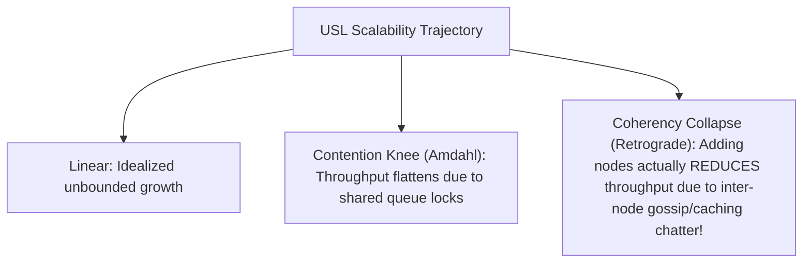
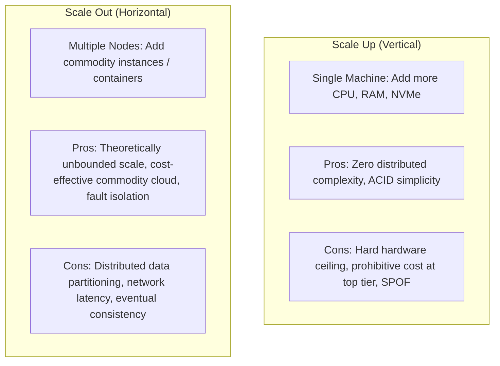
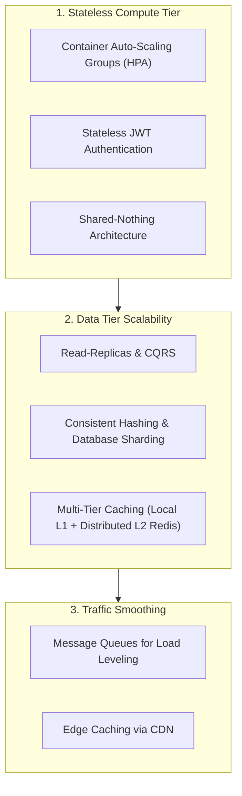

# Scalability

## Definition

Scalability is the architectural ability of a system to handle increasing workloads (requests per second, data volume, concurrent users) gracefully by adding computational resources, without redesigning the core system architecture and without experiencing disproportionate degradation in performance or exponential increases in cost.

---

## Why It Matters

In high-growth enterprises and global digital platforms, system load is rarely static:
- **Traffic Surges**: Flash sales, Black Friday, breaking news events, or tax filing deadlines cause transaction spikes of 10x to 100x baseline within minutes.
- **Data Accumulation**: As enterprise customer bases grow from thousands to tens of millions, databases swell from gigabytes to petabytes, causing unindexed queries to slow to a crawl.
- **Cost Linearity**: An unscalable system exhibits super-linear cost growth—handling double the traffic might require quadrupling infrastructure spend due to resource contention and lock bottlenecks.

---

## How to Measure

Scalability is quantified by measuring system throughput as hardware resources are added:

### 1. Scaling Efficiency / Speedup
$$\text{Speedup } S(N) = \frac{T(1)}{T(N)}$$
Where $T(1)$ is the execution time on 1 node, and $T(N)$ is execution time on $N$ nodes.

- **Linear Scalability (Ideal)**: Doubling hardware resources exactly doubles throughput ($S(N) = N$).
- **Sub-Linear Scalability (Typical)**: Doubling hardware yields 60–80% throughput gain due to network coordination and locking overhead.

### 2. The Universal Scalability Law (USL - Neil Gunther)
The USL models the mathematical reality of distributed scalability by incorporating concurrency contention ($\sigma$) and cross-node coherency penalty ($\kappa$):

$$C(N) = \frac{N}{1 + \sigma(N - 1) + \kappa N(N - 1)}$$

---

## Scaling Dimensions: Vertical vs. Horizontal

---

## Architecture Implications

Architecting for high horizontal scalability requires fundamental design discipline:
- **Strictly Stateless Application Tiers**: Application web servers must not store session state, uploaded files, or in-memory caches locally. All state is externalized to distributed caches (Redis) or databases.
- **Database Partitioning & Sharding**: Monolithic relational databases eventually hit I/O limits. Data must be partitioned horizontally (sharding by `tenant_id` or `user_id`).
- **Asynchronous Decoupling**: Isolate bursty write workloads using durable message brokers (Kafka, SQS) to decouple fast web clients from slower backend processors.

---

## Design Strategies

1. **Shared-Nothing Architecture (SN)**: Design compute nodes so that each node operates independently, eliminating shared disk or memory bottlenecks.
2. **Read-Write Splitting (CQRS)**: Direct all mutation queries (`INSERT`, `UPDATE`) to the primary database, while fanning out high-volume read queries (`SELECT`) across an auto-scaled pool of read-replicas.
3. **Queue-Based Load Leveling**: Place a message queue in front of downstream processing engines. During traffic spikes, requests buffer safely in the queue rather than overwhelming the database.

---

## Trade-offs

| Gained Benefit | Sacrificed Dimension | Why the Tension Exists |
|:---|:---|:---|
| **Horizontal Scalability** | **Operational Simplicity** | Requires managing container orchestrators (K8s), service discovery, load balancers, and distributed tracing. |
| **Horizontal Data Sharding** | **Relational Query Flexibility** | Cross-shard `JOIN` operations become computationally prohibitive or impossible; foreign keys cannot be easily enforced across nodes. |
| **High Throughput Auto-Scaling** | **Cloud Cost Predictability** | Uncapped auto-scaling during DDoS attacks or viral events can trigger astronomical cloud bills without budget alerts. |

---

## Example Requirements

- **ASR-SCAL-01**: "The Order Ingestion API must scale horizontally to handle a peak load of **25,000 write TPS** during flash-sale events, up from a baseline of 1,000 TPS, with auto-scaling provisioning additional worker pods within **90 seconds** of CPU utilization exceeding 70%."
- **ASR-SCAL-02**: "The database tier must be partitioned to support **500 million active customer profiles** and 10 billion historical order records without any single database shard exceeding **2 TB in physical storage size**."
