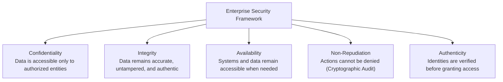
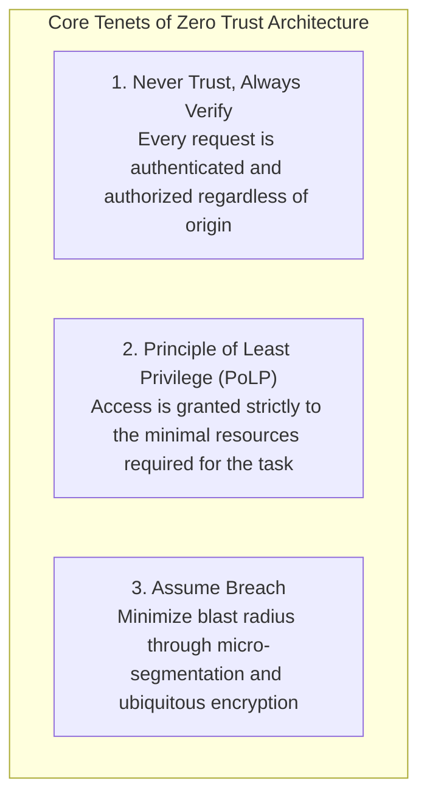
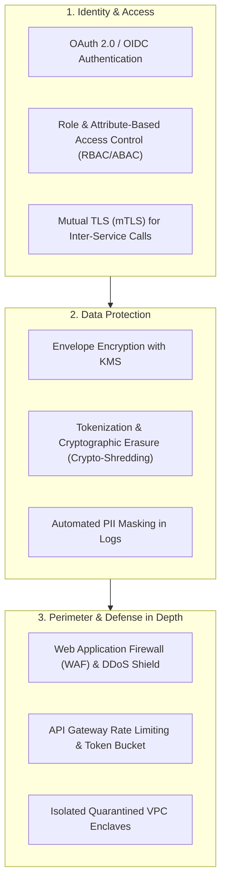

# Security

## Definition

Security is the degree to which a software system protects data and computational resources against unauthorized access, malicious modification, exfiltration, destruction, or denial of service, while ensuring that legitimate users retain authorized access. 

Architectural security is anchored in the classic **CIA Triad**, augmented by modern enterprise governance requirements:

---

## Why It Matters

- **Regulatory Sanctions & Fines**: Violations of GDPR (up to 4% of global turnover), PCI DSS 4.0, HIPAA, or CCPA result in tens of millions of dollars in direct penalties.
- **Ransomware & Operational Halt**: A compromised enterprise perimeter can shut down corporate manufacturing or supply chains for weeks (e.g., Colonial Pipeline).
- **Reputational Brand Destruction**: Breaches of customer financial data, social security numbers, or health records lead to immediate customer defection and catastrophic stock devaluation.

---

## How to Measure

Security posture cannot be proven; it is measured through risk surface reduction and operational response speed:

1. **Common Vulnerability Scoring System (CVSS)**: Severity rating (0.0 to 10.0) of identified software defects and dependencies.
2. **Mean Time to Remediate (MTTR-V)**: Time elapsed from the disclosure of a critical CVE (CVSS $\ge 9.0$) to its deployment in production (target: $\le 24–48\text{ hours}$).
3. **Penetration Test & Red Team Findings**: Number of high/critical vulnerabilities identified during annual third-party ethical hacking engagements (target: 0 criticals).
4. **Static & Software Composition Defect Density**: Percentage of code commits passing SAST/SCA security gates in CI/CD without waivers (target: 100%).

---

## Architecture Implications: The Zero-Trust Model

Traditional "castle-and-moat" perimeter security (trusting anything inside the corporate VPN) is obsolete. Modern solution architecture enforces **Zero Trust**:

- **Ubiquitous Encryption**: Data must be encrypted in transit (TLS 1.3, mTLS) and encrypted at rest (AES-256 with customer-managed KMS keys) across every hop.
- **Identity as the Perimeter**: Perimeter defenses (firewalls) are secondary to cryptographic identity (OAuth 2.0, OpenID Connect, JWT, and SPIFFE/SPIRE).

---

## Design Strategies

1. **Defense in Depth**: Layer security controls so that if the perimeter WAF fails, the API Gateway authentication catches the intruder; if the API Gateway is bypassed, service-level RBAC blocks unauthorized access; if the database is penetrated, column-level AES-256 encryption prevents data theft.
2. **Envelope Encryption**: Data is encrypted with a local Data Encryption Key (DEK). The DEK is encrypted with a Key Encryption Key (KEK) managed in an external Hardware Security Module (HSM / AWS KMS). Never store plain encryption keys on disk.
3. **Crypto-Shredding for GDPR**: Encrypt each individual user's personal records with a unique user-specific cryptographic key. To satisfy GDPR "Right to be Forgotten", simply delete the user's encryption key from the key vault, rendering all historical backups mathematically unreadable.

---

## Trade-offs

| Gained Benefit | Sacrificed Dimension | Why the Tension Exists |
|:---|:---|:---|
| **Deep Security & Encryption** | **Latency & Computational Performance**| Cryptographic handshakes, payload decryption, token introspection, and policy checks add milliseconds to each hop. |
| **Strict Zero-Trust Access** | **Developer Velocity & Ergonomics** | Engineers cannot easily test APIs locally without mock identity providers, valid JWT certificates, and complex permissions. |
| **Complete Audit Logging** | **Storage Cost & Throughput** | Writing immutable cryptographic audit trails for every API call increases I/O overhead and multi-terabyte log ingestion fees. |

---

## Example Requirements

- **ASR-SEC-01**: "All data classified as Personally Identifiable Information (PII) or financial records must be **encrypted at rest using AES-256** and **in transit using TLS 1.3** across both public ingress and internal microservice-to-microservice communication."
- **ASR-SEC-02**: "The system must enforce **attribute-based access control (ABAC)** where API requests without a cryptographically verified, unexpired JWT signed by the corporate Identity Provider are rejected with `HTTP 401 Unauthorized` at the API Gateway perimeter."
