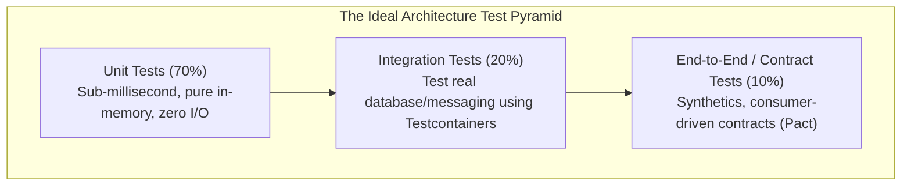
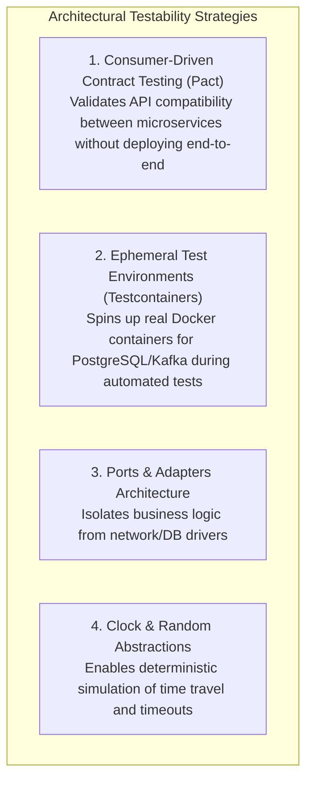

# Testability

## Definition

Testability is the degree to which a software artifact (module, microservice, system) facilitates the creation, execution, and automation of tests that reliably establish its correctness, identify defects, and verify non-functional requirements. 

A system that is difficult or impossible to test in isolation cannot be verified, cannot be refactored with confidence, and cannot support continuous delivery.

---

## Why It Matters

- **Deployment Confidence**: Teams with highly testable architectures deploy to production multiple times a day without fear of regressions.
- **Cost of Defect Remediation**: A defect discovered during a 2-second unit test in local development costs $1 to fix. The same defect discovered in staging costs $100. Discovered in production, it costs $10,000+ in incident triage, executive escalation, and data patching.
- **Elimination of Flaky Manual QA**: Brittle, untestable systems force organizations to rely on massive, weeks-long manual QA regression cycles that destroy agility.

---

## How to Measure

### 1. The Test Pyramid Distribution

### 2. Mutation Testing Score
Code coverage is a vanity metric; a test suite can achieve 90% coverage with zero assertions. **Mutation Testing** (e.g., Stryker, PIT) injects intentional bugs (mutants) into source code to verify whether test suites detect and fail on them:
$$\text{Mutation Score Indicator (MSI)} = \frac{\text{Killed Mutants}}{\text{Total Mutants}} \times 100$$
- **Target**: Maintain an MSI of **$\ge 75\%$** on core domain logic.

### 3. Test Suite Execution Duration
- **Unit Test Suite**: Total run time **$< 3\text{ minutes}$** for the entire repository.
- **Integration Test Suite**: Total run time **$< 10\text{ minutes}$** in CI.

### 4. Flakiness Rate
$$\text{Flakiness} = \frac{\text{Test Runs Failing without Code Change}}{\text{Total Test Executions}} \times 100$$
- **Target**: **$< 0.1\%$**. A flaky test suite erodes developer trust and is ignored.

---

## Architecture Implications

Architectures are made testable through explicit design decisions:
- **Dependency Inversion (DI)**: Components must depend on abstractions (interfaces) rather than concrete implementations, allowing external databases and third-party APIs to be easily mocked or stubbed.
- **State Externalization & Determinism**: Systems must avoid hidden global static state, non-deterministic system clocks (`DateTime.Now` injected as a clock interface), and unseeded random number generators.
- **Observability Hooks**: The architecture must expose diagnostic endpoints, correlation headers, and internal queues to test harnesses.

---

## Design Strategies

1. **Consumer-Driven Contract Testing (Pact)**: Microservices avoid fragile, slow end-to-end staging environments. Service consumers publish contracts defining expected request/response payloads; provider CI pipelines verify contracts against provider code in isolation.
2. **Ephemeral Integration Testing (Testcontainers)**: Instead of mocking the database (which hides SQL syntax errors and dialect mismatches), integration tests spin up lightweight, ephemeral Docker instances of PostgreSQL or Redis that terminate automatically when tests complete.
3. **Seam-Driven Architecture**: Introduce architectural "seams" (interfaces, middleware pipelines, event interceptors) where test harnesses can inspect state and inject faults.

---

## Trade-offs

| Gained Benefit | Sacrificed Dimension | Why the Tension Exists |
|:---|:---|:---|
| **High Testability (Mockable Interfaces)** | **Boilerplate Code Volume** | Requires defining interfaces, factories, and dependency injection registration for every component. |
| **Real Ephemeral Containers (Testcontainers)**| **CI Pipeline Execution Time** | Spinning up Docker containers in CI consumes more compute and takes longer than pure in-memory mocks. |
| **Strict Determinism** | **Rapid Scripting Hacks** | Developers cannot use convenient static singletons or global helper methods. |

---

## Example Requirements

- **ASR-TEST-01**: "All core business domain modules must achieve **$\ge 80\%$ branch coverage** and **$\ge 75\%$ mutation test score**, executing 100% of unit tests in-memory in **$< 120\text{ seconds}$** without external network or database dependencies."
- **ASR-TEST-02**: "All asynchronous event consumers and external REST integrations must maintain **Consumer-Driven Contract tests (Pact)** that execute automatically on every pull request, preventing breaking schema changes from deploying to staging."
