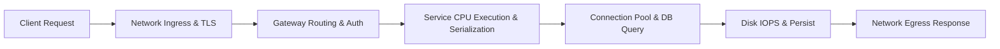

# Performance Engineering

## 1. Scope & Architecture Philosophy
Performance engineering is the rigorous discipline of designing, profiling, measuring, and optimizing the computational efficiency, latency profiles, and throughput capabilities of software systems. In distributed enterprise environments, performance is not an afterthought addressed through micro-benchmarking—it is an architectural quality attribute built into data serialization, thread synchronization, connection pooling, and asynchronous topologies.

---

## 2. The Core Triad: Latency, Throughput, and Saturation

| Dimension | Definition | Primary Unit | Optimization Focus |
| :--- | :--- | :--- | :--- |
| **Latency** | The time required to process a single unit of work from initiation to completion. | Milliseconds ($\text{ms}$), Microseconds ($\mu\text{s}$) | Algorithmic complexity, caching, zero-copy I/O. |
| **Throughput** | The volume of work units completed per unit of time. | RPS, QPS, Transactions/sec, MB/s | Horizontal parallelism, non-blocking I/O, batching. |
| **Saturation** | The degree to which an underlying hardware/logical resource is fully occupied. | Percentage ($\%$) | Capacity headroom, queue management, load shedding. |

---

## 3. Directory Structure
* [Latency](latency.md)
* [Throughput](throughput.md)
* [Response Time](response-time.md)
* [p50, p95, p99 Latency](p50-p95-p99.md)
* [Tail Latency](tail-latency.md)
* [CPU Bottlenecks](cpu-bottlenecks.md)
* [Memory Bottlenecks](memory-bottlenecks.md)
* [Database Bottlenecks](database-bottlenecks.md)
* [Network Bottlenecks](network-bottlenecks.md)
* [I/O Bottlenecks](io-bottlenecks.md)
* [Connection Pools](connection-pools.md)
* [Thread Pools](thread-pools.md)
* [Asynchronous Processing](async-processing.md)
* [Performance Budget](performance-budget.md)
* [Load Testing](load-testing.md)
* [Stress Testing](stress-testing.md)
* [Soak Testing](soak-testing.md)
* [Performance Optimization](performance-optimization.md)
