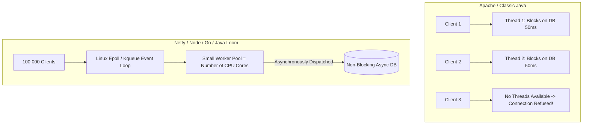

# Asynchronous Processing & Non-Blocking I/O

## 1. Concurrency Models Comparison
Synchronous blocking architectures allocate one operating system thread per connection. Under massive concurrency ($10^5+$ connections), this model collapses due to thread stack memory consumption and OS context-switching overhead.

---

## 2. Java Virtual Threads (Project Loom) vs. Reactive Streams
* **Reactive Programming (Project Reactor, RxJava)**: Delivers exceptional resource efficiency but introduces steep cognitive complexity, fragmented call stacks, and difficult debugging.
* **Virtual Threads (JDK 21+)**: Restores simple imperative code (`thread-per-request` syntax) while executing over lightweight user-space fibers mounted dynamically to carrier OS threads.
