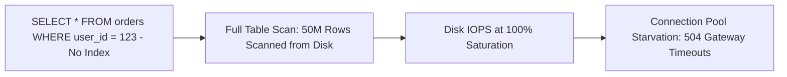

# Database Bottleneck Analysis

## 1. Primary Sources of Database Performance Degradation
In 90% of enterprise performance escalations, the root cause resides in the database tier:
1. **Missing or Degrading Indexes**: Queries performing Sequential Scans ($O(N)$) across millions of disk pages rather than Index Lookups ($O(\log N)$).
2. **Lock Contention**: Transactions holding exclusive row or table locks for extended periods, queueing up hundreds of concurrent waiting sessions.
3. **Buffer Pool Cache Churn**: Working set exceeding physical RAM, forcing disk thrashing.

---

## 2. Query Optimization Methodology
* **Explain Plan Inspection (`EXPLAIN ANALYZE`)**: Look for `Seq Scan`, `Hash Join` with high disk spills, and high `Rows Removed by Filter`.
* **Covering Indexes**: Create composite indexes containing all columns referenced in `SELECT` and `WHERE` clauses (`INDEX (user_id) INCLUDE (status, total)`), enabling **Index-Only Scans** that bypass table heap disk reads entirely.
* **Transaction Scope Minimization**: Never execute external HTTP calls or heavy computations inside an active SQL transaction.
