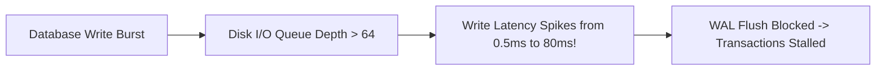

# Storage & Disk I/O Bottlenecks

## 1. Storage Physics: Sequential vs. Random I/O
* **Sequential I/O**: Reading or writing contiguous disk sectors. NVMe SSDs sustain $3,000\text{--}7,000\text{ MB/s}$.
* **Random I/O**: Reading or writing disparate disk blocks across the filesystem. Bounded by discrete IOPS limits ($10,000\text{--}64,000\text{ IOPS}$).

---

## 2. Disk Queue Depth & Latency Explosion
As disk queue depth exceeds storage controller parallelism, write wait times climb exponentially:
$$\text{I/O Latency} = \text{Service Time} \times \left(1 + \frac{\text{Queue Depth}}{\text{Storage Parallel Channels}}\right)$$

---

## 3. Modern Linux Asynchronous I/O: `io_uring`
Traditional synchronous disk reads block the calling thread (`read(2)`). Modern high-performance storage engines leverage **`io_uring`** (Linux kernel 5.1+):
* Submits batched I/O requests via shared ring buffers without context switches.
* Delivers up to $2,000,000\text{ IOPS}$ from a single CPU core.
