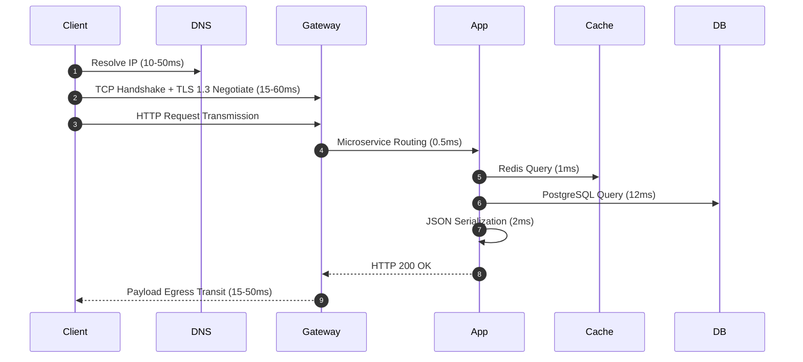

# Latency Engineering

## 1. Anatomical Breakdown of End-to-End Latency
Latency is the total elapsed time between when a client initiates an action and when the result is fully rendered. In distributed architectures, latency is composite:
$$T_{\text{total}} = T_{\text{DNS}} + T_{\text{TCP\_TLS}} + T_{\text{transit}} + T_{\text{gateway}} + T_{\text{compute}} + T_{\text{db}} + T_{\text{serialization}}$$

---

## 2. Mathematical Models & Latency Budgeting
When an endpoint's SLO specifies $p99 < 100\text{ ms}$, latency budgeting apportions millisecond allowances across the distributed dependency tree:
$$\sum_{i=1}^{k} \text{Budget}_i \le \text{Target SLO} \times 0.75\text{ (25% Headroom)}$$

### Sample Budget Distribution for $100\text{ ms}$ SLO:
* **Network & Edge CDN**: $35\text{ ms}$ (Speed of light, TLS, last-mile ISP)
* **API Gateway / WAF**: $5\text{ ms}$
* **Application Business Logic**: $10\text{ ms}$
* **Persistence / Cache Tier**: $25\text{ ms}$
* **Buffer Safety Cushion**: $25\text{ ms}$
