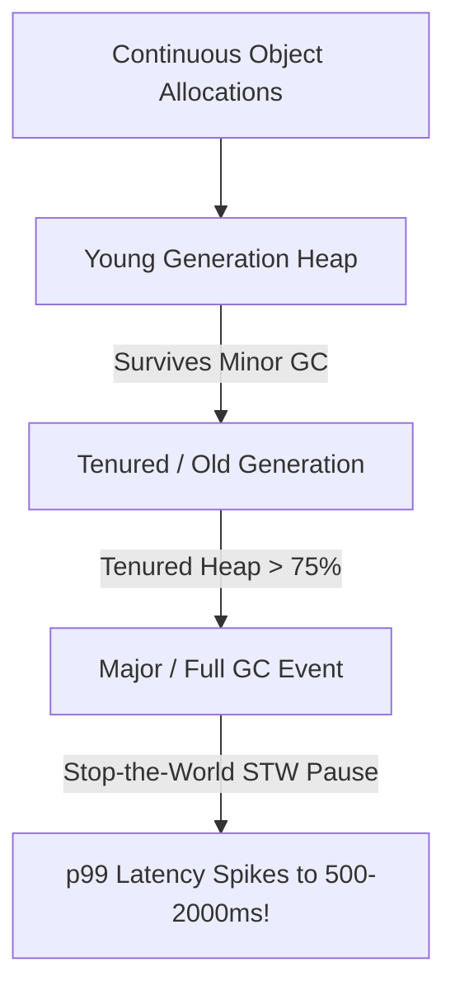

# Memory Bottlenecks & Garbage Collection

## 1. Principles of Memory Management
Memory bottlenecks manifest either as raw capacity exhaustion (triggering the operating system Out-Of-Memory killer) or runtime latency spikes induced by Garbage Collection (GC) pauses.

---

## 2. Managed Runtimes: Tuning GC for Low Latency
* **Java Virtual Machine (JVM)**:
  * *Traditional Collectors (Parallel, CMS)*: High throughput, but introduce $100\text{ms}\text{--}2000\text{ms}$ Stop-the-World pauses.
  * *Low-Latency Collectors (ZGC, Shenandoah)*: Perform concurrent marking and evacuation, capping STW pauses at $<1\text{ ms}$ even on multi-terabyte heaps.
* **Go Runtime GC**:
  * Optimized for microsecond latency ($<0.5\text{ ms}$ STW pauses) using a concurrent tricolor mark-and-sweep collector with `GOGC` target pacing.

---

## 3. Memory Leaks in Cloud Services
* **Static Reference Retention**: Storing objects in unmanaged static collections, ThreadLocals, or global maps.
* **Unbounded In-Memory Caches**: Caching entries in process memory without an LRU maximum size limit or TTL expiration.
* **Connection / Stream Leaks**: Failing to close HTTP response bodies or database cursors in `finally` blocks, leaking native socket buffers.
