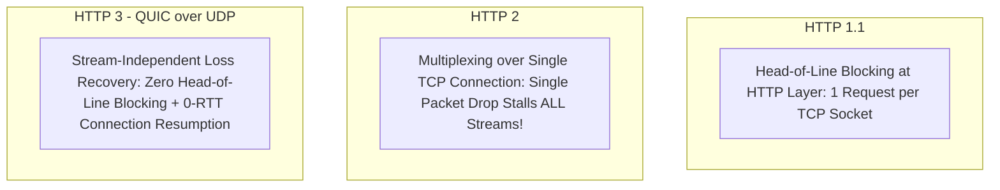

# Network Bottlenecks & Transport Optimization

## 1. Physical & Transport Layer Constraints
Network latency is fundamentally bounded by the speed of light in fiber optic glass ($\approx 200\text{ km/ms}$). Even with infinite bandwidth, physical transit time cannot be reduced.

---

## 2. Bandwidth-Delay Product (BDP)
The Bandwidth-Delay Product determines the volume of in-flight unacknowledged data required to fully saturate a network link:
$$\text{BDP} = \text{Bandwidth (bits/sec)} \times \text{Round-Trip Time (RTT in seconds)}$$

*For a 10 Gbps cross-country link with 50ms RTT*:
$$\text{BDP} = 10 \times 10^9 \times 0.050 = 500,000,000\text{ bits} \approx 62.5\text{ MB}$$
*If the TCP window size is capped at 64KB, the connection can utilize less than $1\%$ of available bandwidth!* (Modern systems enable TCP Window Scaling via `net.ipv4.tcp_window_scaling = 1`).

---

## 3. Protocol Evolution: HTTP/1.1 vs. HTTP/2 vs. HTTP/3 (QUIC)

