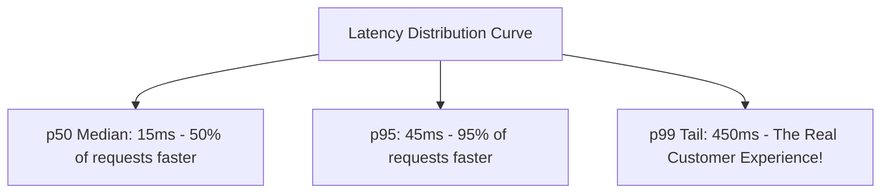

# Percentiles: p50, p95, and p99 Latency

## 1. The Fallacy of the Average
Averages are meaningless in distributed systems. An "average latency of 25ms" can completely conceal the fact that $5\%$ of users experience a disastrous 5,000ms outage. A single extreme outlier distorts arithmetic means:
$$\text{Mean} = \frac{\sum x_i}{N}$$

---

## 2. Percentile Definitions & Architecture Targets
* **$p50$ (Median)**: The 50th percentile. $50\%$ of requests are faster than this threshold. Represents standard steady-state behavior.
* **$p95$**: The 95th percentile. Captures minor cache misses and occasional GC cycles.
* **$p99$**: The 99th percentile. Represents the worst 1 in 100 requests. SRE Service Level Agreements (SLAs) are almost universally pegged to $p99$.
* **$p99.9$ (Three Nines)**: The worst 1 in 1,000 requests. Essential for high-frequency e-commerce and algorithmic finance where high-value customers execute dozens of transactions.
