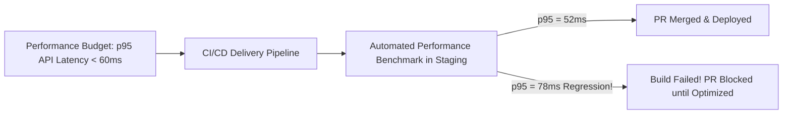

# Performance Budgeting & Governance

## 1. Defining Performance Budgets
A Performance Budget is a strict, quantitative constraint imposed on engineering teams to ensure software does not silently degrade over successive releases.

---

## 2. Sample Enterprise Performance Budget Allocation

| Engineering Layer | Target Metric | Hard Budget Ceiling | Failure Action |
| :--- | :--- | :--- | :--- |
| **Frontend Bundle Size** | Initial JavaScript Payload | $\le 200\text{ KB}$ (Gzipped) | Webpack/Vite build error. |
| **API Gateway Transit** | Overhead added by Gateway | $\le 3\text{ ms}$ ($p99$) | Alert on gateway plugin regressions. |
| **Microservice CPU Time** | Business Logic Execution | $\le 15\text{ ms}$ ($p95$) | Automated canary rollback. |
| **Database Query Budget**| Queries per HTTP Request | $\le 4\text{ SQL queries}$ | Unit test fails on $N+1$ query detection. |
| **Database Query Time**  | Slowest single query | $\le 20\text{ ms}$ ($p99$) | Block migration without covering index. |
