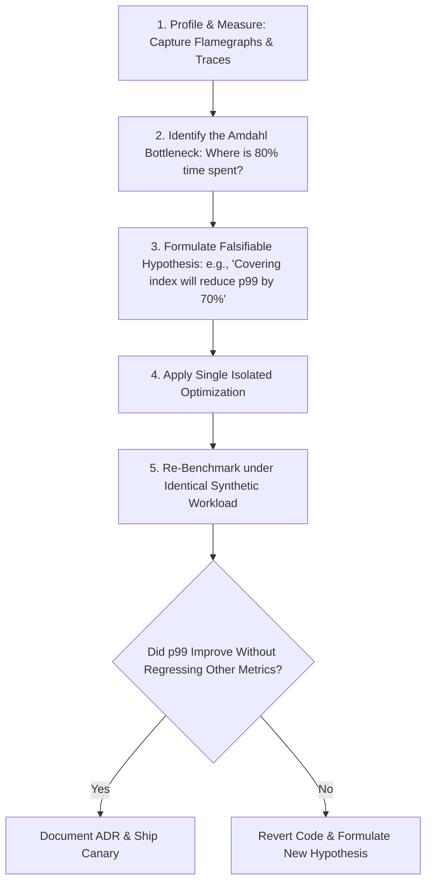

# Performance Optimization Methodology

## 1. The 6-Step Scientific Optimization Framework
Performance optimization must follow a rigorous, empirical methodology. Optimizing code based on intuition or subjective opinions almost always optimizes non-critical code paths while introducing bugs.

---

## 2. Profiling Tools & Techniques
* **CPU Flamegraphs (Async-profiler / Linux `perf`)**: Visualizes call stack sample frequencies to pinpoint CPU-burning functions.
* **Database Query Profiling**: PostgreSQL `pg_stat_statements`, MySQL Performance Schema, and slow query logs.
* **Distributed Tracing (OpenTelemetry)**: Analyzes waterfall charts across microservice boundaries to locate cross-network latency bottlenecks.
