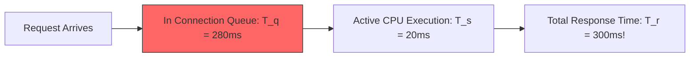

# Response Time vs. Service Time

## 1. Critical Distinction in System Profiling
A common engineering error is confusing **Service Time** with **Response Time**:
* **Service Time ($T_s$)**: The time the system actually spends actively processing a request (CPU cycles, disk read, network socket execution).
* **Queue Wait Time ($T_q$)**: The time the request sits idle in OS socket buffers, HTTP thread pool queues, or database connection queues waiting for a free worker.
* **Response Time ($T_r$)**:
  $$T_r = T_q + T_s$$

---

## 2. The Saturation Trap
When a server operates at $95\%$ utilization, service time ($T_s$) remains constant at $20\text{ ms}$, but queue wait time ($T_q$) explodes to hundreds of milliseconds. Profiling code execution without measuring queue residency produces misleading conclusions.
