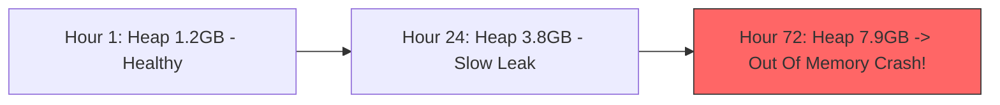

# Soak (Endurance) Testing

## 1. Detecting Insidious Long-Tail Degradation
Many catastrophic production outages are caused by defects that only surface after days or weeks of continuous runtime operation. **Soak testing** runs a sustained, steady-state workload ($70\%\text{--}80\%$ load) continuously for **24 to 72 hours**.

---

## 2. Critical Defects Uncovered by Soak Testing
* **Slow Memory Leaks**: Objects held in static collections, unbounded thread-local maps, or uncollected event listeners.
* **Database Connection Leaks**: Backend exceptions that bypass `connection.close()` or `try-with-resources` blocks, gradually consuming connection pools.
* **File Descriptor & Socket Leaks**: Unclosed HTTP response bodies leaving TCP sockets in `CLOSE_WAIT` state until the Linux `ulimit -n` limit is breached.
* **Disk Saturation**: Rapidly growing unrotated container logs or unvacuumed database dead tuples.
