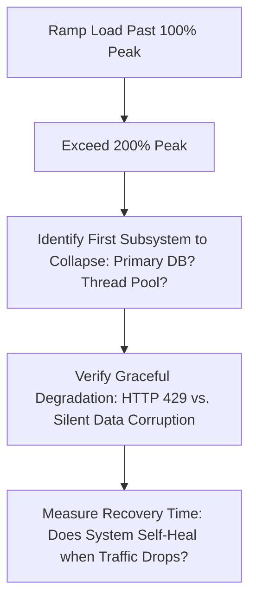

# Stress Testing & Breakpoint Identification

## 1. Purpose: Finding the Knee of the Curve
While load testing verifies operation under expected traffic, **stress testing deliberately pushes the architecture past peak capacity until catastrophic failure occurs**.

---

## 2. Stress Testing Validation Criteria
1. **Predictable Breakpoint**: The system must fail at a known, documented threshold (e.g., collapses at $42,000\text{ RPS}$ due to primary database write IOPS).
2. **Graceful Rejection**: Under extreme stress, API gateways and load balancers must reject surplus traffic immediately with `HTTP 429 Too Many Requests` or `HTTP 503 Service Unavailable`, shielding database and worker tiers from thread exhaustion.
3. **Zero Cascading Failures**: When the stress test terminates, the system must recover to baseline latency in $<3\text{ minutes}$ without human intervention or manual container restarts.
