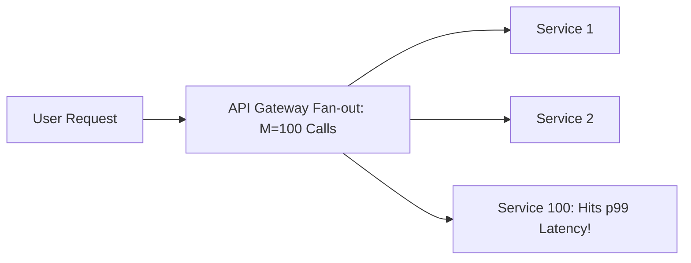

# Tail Latency & Latency Amplification

## 1. The Tail at Scale (The Jeff Dean Multiplier)
In microservice architectures where a single user request fans out to $M$ downstream services in parallel, the user's observed latency is governed by the **slowest component in the fan-out tree**:
$$P(\text{User experiences } p99) = 1 - (1 - 0.01)^M$$

### Cumulative Latency Penalty Table
| Number of Downstream Calls ($M$) | Probability User Sees $\ge p99$ Tail Latency |
| :--- | :--- |
| **1** | $1.0\%$ |
| **10** | $1 - (0.99)^{10} \approx \mathbf{9.5\%}$ |
| **50** | $1 - (0.99)^{50} \approx \mathbf{39.5\%}$ |
| **100** | $1 - (0.99)^{100} \approx \mathbf{63.4\%}$ |

*At 100 microservice fan-outs, nearly two-thirds of all users experience the p99 latency tail!*

---

## 2. Mitigating Tail Latency

### 1. Hedged Requests (Speculative Retry)
Send the request to Replica A. If no response is received by the 95th percentile time ($T_{p95}$), send a duplicate "hedged" request to Replica B. Take whichever completes first and cancel the slower request.
* *Result*: Drops $p99.9$ latency by $80\%$ with only a $5\%$ increase in total cluster traffic.

### 2. Microsecond-Tuned Request Deadlines
Propagate context deadlines across all downstream gRPC/HTTP calls. If the client budget is $100\text{ ms}$ and $80\text{ ms}$ has elapsed, downstream calls abort immediately rather than wasting CPU cycles on hopeless requests.
