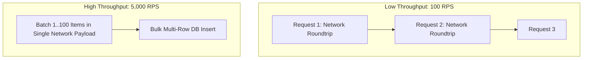

# Throughput Architecture

## 1. Principles of Throughput
Throughput measures the rate of successful work processing over time. It is bounded by Little's Law ($L = \lambda W$) and system concurrency limits. Maximizing throughput without inflating latency requires minimizing thread blocking and maximizing hardware resource efficiency.

---

## 2. Maximizing Throughput: Batching vs. Pipelining

### The Efficiency Formula of Batching
$$\text{Throughput}_{\text{batched}} = \frac{N \times \text{Payload Size}}{T_{\text{fixed\_overhead}} + (N \times T_{\text{item\_process}})}$$
* As batch size $N$ increases, fixed network round-trip overhead ($T_{\text{fixed\_overhead}}$) is amortized across $N$ elements, driving throughput to near-wire speed.
* *Trade-off*: Batching increases average latency for individual items waiting in the batch buffer window (e.g., $10\text{ ms}$ linger time).
