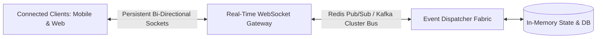

# Real-Time Systems Architecture

## 1. Overview & Architectural Philosophy
Real-time communication architectures enable sub-second, bi-directional, or push-based data distribution between servers and millions of concurrent client devices. Systems like instant messaging, live sports telemetry, collaborative document editing, financial market data tickers, and ride-hailing tracking require alternatives to traditional request-response HTTP polling.

---

## 2. Real-Time Transport Protocols Comparison

| Protocol | Transport | Directionality | Connection Model | Overhead / Latency | Ideal Fit |
| :--- | :--- | :--- | :--- | :--- | :--- |
| **Short Polling** | HTTP/1.1 or 2 | Unidirectional (Client pulls) | New TCP/HTTP connection per poll | Extreme (Headers on every poll) | Low-frequency status checks. |
| **Long Polling** | HTTP/1.1 or 2 | Unidirectional (Server holds) | Hanging HTTP connection | Moderate (Re-establishes on data) | Legacy browsers, firewalled networks. |
| **Server-Sent Events** | HTTP/2 or 3 | Unidirectional (Server $\to$ Client) | Persistent single HTTP stream | Very Low (Plaintext UTF-8 stream) | Stock tickers, sports scores, AI tokens. |
| **WebSockets** | TCP (RFC 6455) | Bi-directional (Full Duplex) | Upgraded single TCP socket | Minimal (2-6 byte frame overhead) | Chat, multiplayer gaming, collaboration. |
| **WebRTC** | UDP (SRTP / SCTP) | Peer-to-Peer (Bi-directional) | Direct P2P with STUN/TURN | Lowest (Sub-50ms voice/video) | Video conferencing, voice streaming. |

---

## 3. Directory Structure
* [WebSockets](websockets.md)
* [Server-Sent Events (SSE)](server-sent-events.md)
* [Long Polling](long-polling.md)
* [Short Polling](polling.md)
* [WebRTC](webrtc.md)
* [Connection Management at Scale](connection-management.md)
* [Presence Systems](presence-system.md)
* [Chat Architecture](chat-architecture.md)
* [Notification Systems](notification-system.md)
* [Live Updates & Dashboard Feeds](live-updates.md)
