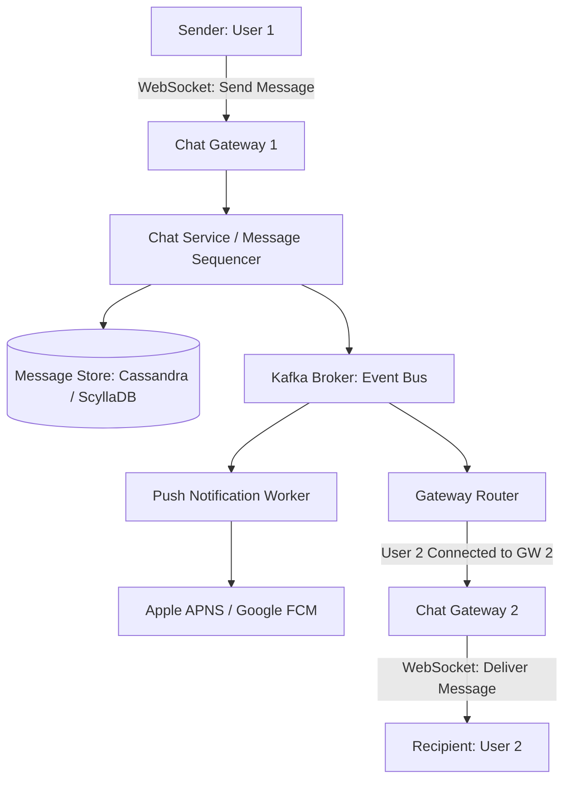

# Distributed Chat System Architecture

## 1. End-to-End Chat Topology



---

## 2. Storage Engine: Why Cassandra / ScyllaDB?
* **Write Optimization**: Chat messages are immutable, append-only records with a $1:1$ read-to-write ratio. LSM-tree stores write at memory speed.
* **Partition Key Design**:
  ```sql
  CREATE TABLE messages (
      conversation_id UUID,
      message_id      TIMEUUID,
      sender_id       UUID,
      content         TEXT,
      PRIMARY KEY (conversation_id, message_id)
  ) WITH CLUSTERING ORDER BY (message_id DESC);
  ```
  * All messages for a conversation reside on the same partition, ordered by timestamp in reverse for instant $O(1)$ channel history retrieval.
