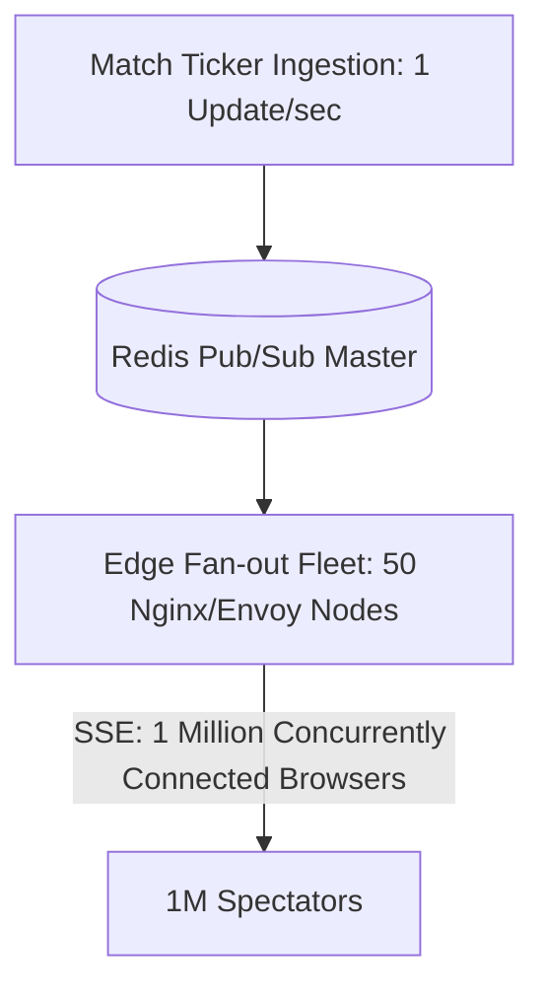

# Live Updates & Dashboard Feeds

## 1. Sports & Financial Ticker Architecture
Distributing real-time live match scores or trading prices to millions of concurrent spectators requires tiered fan-out distribution to protect core application servers.

---

## 2. Fan-out Ratio Optimization
* **Single SSE Connection per Edge Node**: The edge proxy opens **1 connection** to the origin Redis/Kafka stream.
* The edge proxy local memory fan-outs that single stream to **$50,000$ connected browser sockets**, achieving a **50,000:1 offload ratio** on the backend.
