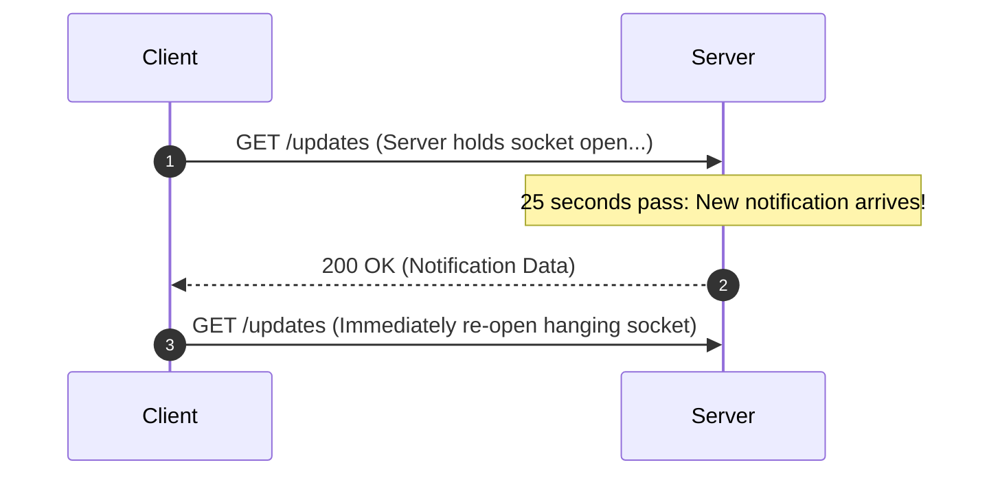

# Long Polling Architecture

## 1. Mechanics of Hanging HTTP Requests
In Long Polling, the client issues an HTTP request. The server **holds the request open** (up to 30–60 seconds) until fresh data arrives. Once data is returned, the client immediately initiates a new request.

---

## 2. Operational Trade-offs
* **Advantage**: Universally compatible with all enterprise proxies, corporate firewalls, and legacy web browsers.
* **Disadvantage**: High header serialization overhead and continuous TCP connection cycling when update frequencies are high.
