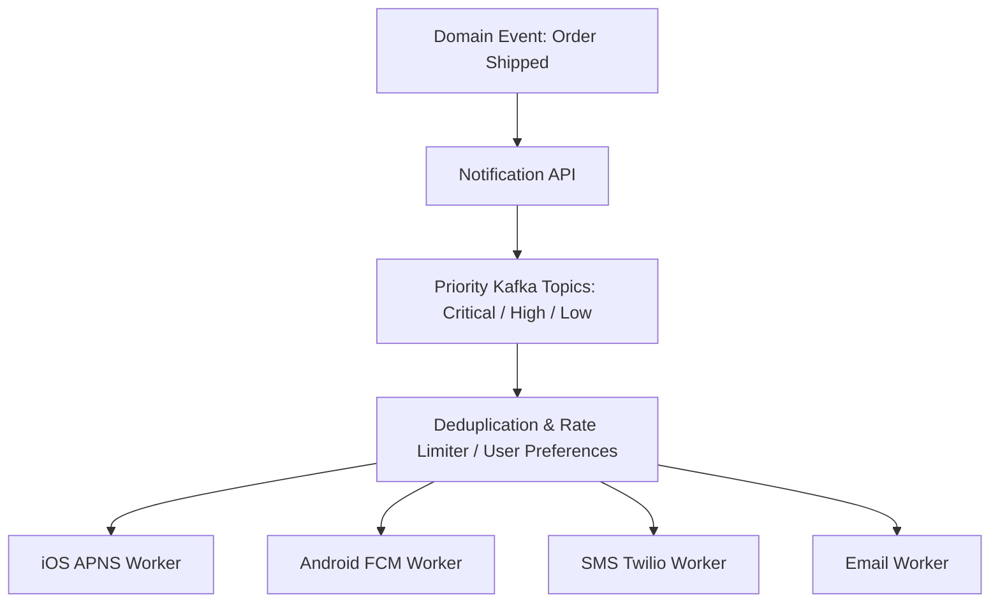

# Notification System Architecture

## 1. Multi-Channel Notification Pipeline
Enterprise notification systems fan out events across multiple delivery channels (iOS APNS, Android FCM, SMS Twilio, Email SendGrid, Web Push).

---

## 2. Essential Reliability Controls
* **User Notification Settings**: Check user opt-in preferences and "Do Not Disturb" quiet hours (local timezone) before dispatch.
* **Rate Limiting & Digesting**: Prevent notifying a user 50 times in 1 minute; aggregate notifications into a single periodic digest (e.g., "Alice and 14 others liked your post").
