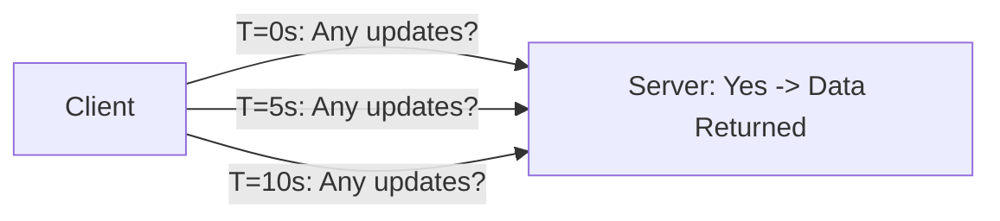

# Short Polling Architecture

## 1. Periodic Query Model
The client sends an HTTP request at a fixed time interval $\Delta t$ (e.g., every 5 seconds), regardless of whether data has changed.

---

## 2. Mathematical Waste at Scale
If $1,000,000$ active users poll every $5\text{ seconds}$:
$$\text{Ingress Incurred} = \frac{1,000,000}{5} = \mathbf{200,000\text{ RPS}}$$
* If data changes only once every 10 minutes, **$99.2\%$ of requests are wasted empty polls**, burning bandwidth and database IOPS.
* *When to use*: Low-concurrency, slow-changing administrative dashboards (e.g., polling every 60s for batch job completion).
