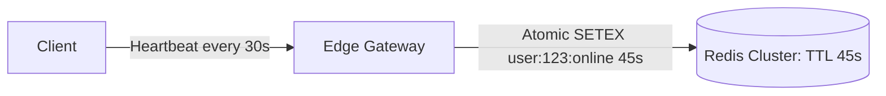

# Presence Systems Architecture (Online/Offline Status)

## 1. Sizing the Heartbeat Avalanche
In platforms with millions of users (Slack, Discord, WhatsApp), tracking online/away/offline state is challenging:
* If $10,000,000$ users send a presence heartbeat every $15\text{ seconds}$:
  $$\text{Heartbeat Ingress} = \frac{10,000,000}{15} \approx \mathbf{666,666\text{ RPS}}$$
* Directly updating a relational database at $666\text{k RPS}$ causes total database collapse.

---

## 2. Ephemeral TTL & Fan-out Mitigation
* **Redis Key Expiration**: When a client pings, set an ephemeral key in Redis with a 45-second TTL (`SETEX presence:{user_id} 45 "ONLINE"`). If no ping arrives in 45 seconds, the key expires, transitioning user to "OFFLINE".
* **Fan-Out on Read**: Do not broadcast presence changes to all $1,000$ friends on every heartbeat. Fetch presence lazily when a user actually opens a chat window or channel.
