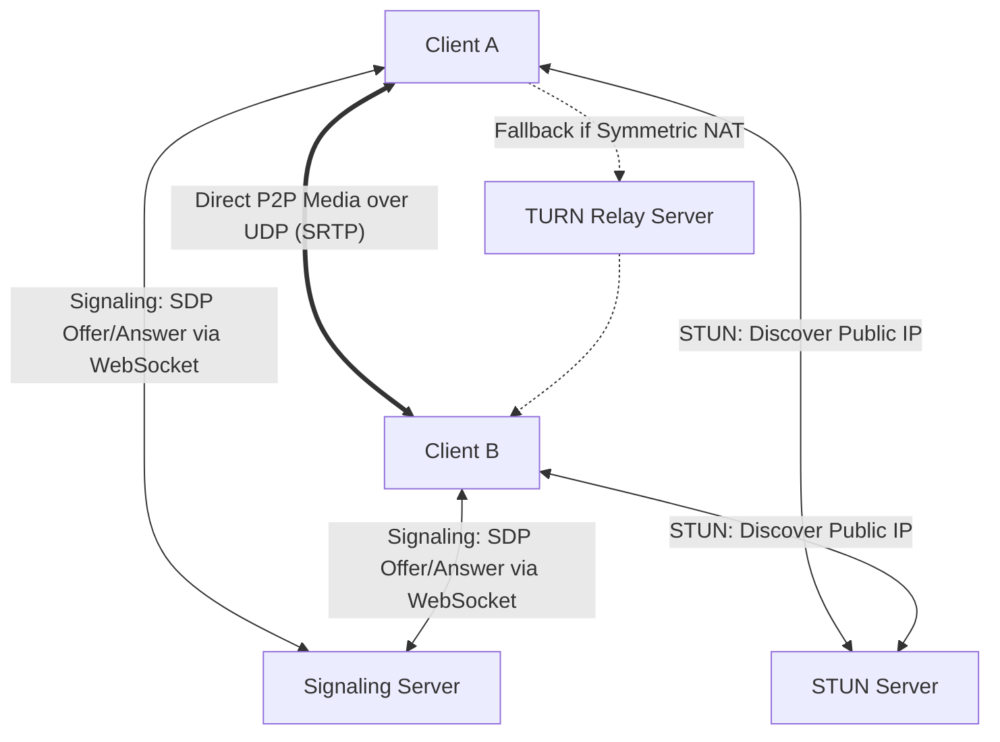

# WebRTC Architecture

## 1. Peer-to-Peer Real-Time Media
WebRTC provides sub-50ms peer-to-peer audio, video, and arbitrary binary data streaming directly between browser clients over UDP (using SRTP and SCTP).

---

## 2. Core Infrastructure Components
* **Signaling Server**: Exchanges session descriptions (SDP) and ICE candidates over WebSockets/HTTP.
* **STUN (Session Traversal Utilities for NAT)**: Discovers the client's public IP address and port behind NAT.
* **TURN (Traversal Using Relays around NAT)**: Relays media packets through a centralized server when strict symmetric corporate firewalls prevent direct P2P connections ($8\%\text{--}15\%$ of enterprise calls).
