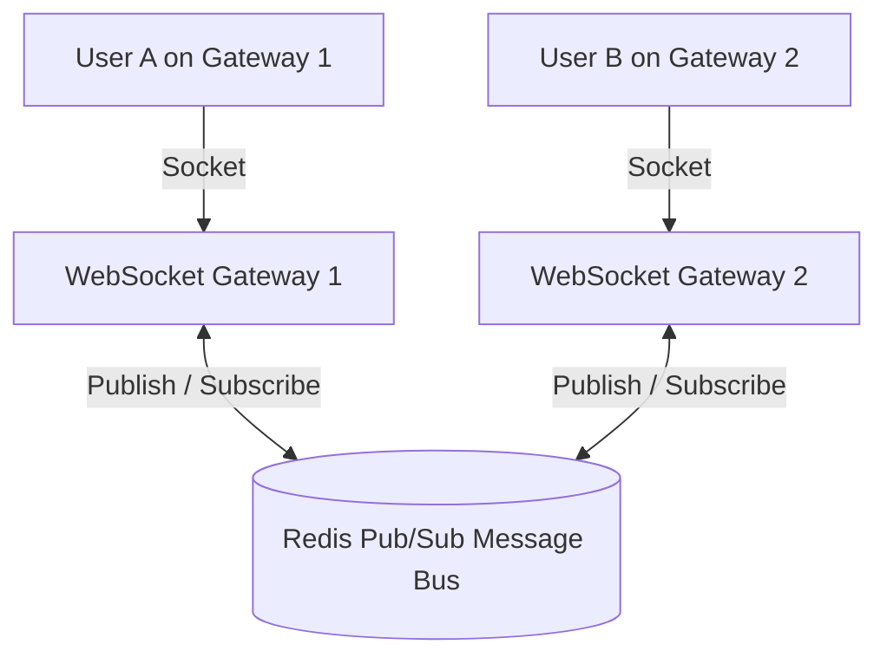

# WebSockets Architecture (RFC 6455)

## 1. Protocol Handshake & Framing
WebSockets establish a persistent, full-duplex, bi-directional communication channel over a single TCP socket. The connection initiates as a standard HTTP/1.1 request and upgrades dynamically:

```http
GET /chat HTTP/1.1
Host: api.enterprise.com
Upgrade: websocket
Connection: Upgrade
Sec-WebSocket-Key: dGhlIHNhbXBsZSBub25jZQ==
Sec-WebSocket-Version: 13
```
Server responds with `HTTP 101 Switching Protocols`, and subsequent frames switch to binary WebSocket framing ($2\text{--}6\text{ bytes}$ overhead per message, compared to $500\text{--}1000\text{ bytes}$ for an HTTP request).

---

## 2. Clustered WebSocket Architecture with Redis Pub/Sub



* Because User A and User B are connected to different physical gateway servers, cross-server message delivery is federated via an internal **Redis Pub/Sub** or **Kafka** cluster bus.
