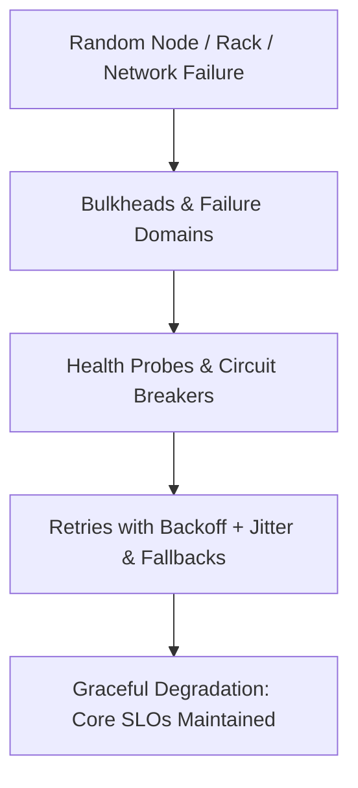

# Reliability Engineering & Fault Tolerance

## 1. Overview & Architectural Philosophy
Reliability is the probability that a distributed system functions correctly, without failure, under specified operating conditions over a given duration. In enterprise systems spanning thousands of servers, networks, and cloud availability zones, **component failure is not an anomaly—it is a mathematical certainty**.

---

## 2. Universal Reliability Metrics

| Metric | Full Name | Definition & Equation | Target Benchmark |
| :--- | :--- | :--- | :--- |
| **MTBF** | Mean Time Between Failures | $\text{MTBF} = \frac{\text{Total Operational Time}}{\text{Number of Failures}}$ | Months to Years |
| **MTTR** | Mean Time to Recover | $\text{MTTR} = \frac{\text{Total Downtime}}{\text{Number of Incidents}}$ | $< 15\text{ minutes}$ (Automated) |
| **Availability**| System Availability | $A = \frac{\text{MTBF}}{\text{MTBF} + \text{MTTR}} \times 100\%$ | $99.99\%$ (Four Nines) |
| **Error Budget**| Allowable Downtime | $\text{Budget} = 1.0 - \text{SLO Target}$ | $4.38\text{ mins/month for } 99.99\%$ |

---

## 3. Directory Structure
* [Availability Modeling](availability-modeling.md)
* [Reliability Modeling](reliability-modeling.md)
* [Failure Domains](failure-domains.md)
* [Single Points of Failure](single-points-of-failure.md)
* [Redundancy](redundancy.md)
* [Replication](replication.md)
* [Failover](failover.md)
* [Health Checks](health-checks.md)
* [Timeouts](timeouts.md)
* [Retries](retries.md)
* [Exponential Backoff](exponential-backoff.md)
* [Jitter](jitter.md)
* [Circuit Breaker](circuit-breaker.md)
* [Bulkheads](bulkheads.md)
* [Rate Limiting](rate-limiting.md)
* [Backpressure](backpressure.md)
* [Load Shedding](load-shedding.md)
* [Graceful Degradation](graceful-degradation.md)
* [Fallbacks](fallbacks.md)
* [Idempotency](idempotency.md)
* [Dead Letter Queues](dead-letter-queues.md)
* [Poison Messages](poison-messages.md)
* [Chaos Engineering](chaos-engineering.md)
