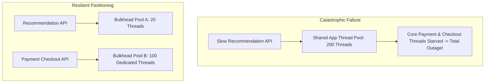

# Bulkhead Architecture

## 1. The Nautical Analogy
In naval architecture, bulkheads are watertight partitions dividing a ship's hull. If one compartment is breached by an iceberg, water fills only that single section; the remaining watertight compartments keep the vessel afloat.

---

## 2. Bulkhead Implementations
1. **Thread Pool Bulkheads**: Dedicating isolated thread pools with bounded task queues per external dependency.
2. **Semaphore Bulkheads**: Bounding concurrent in-flight requests without thread context switching overhead.
3. **Hardware / Pod Bulkheads**: Isolating Tier-1 enterprise tenants on dedicated Kubernetes node pools.
