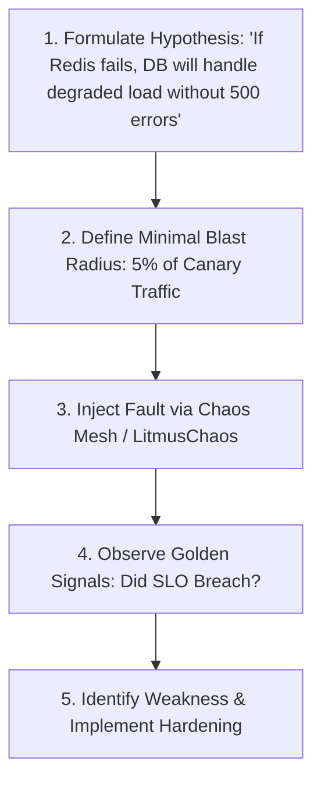

# Chaos Engineering & Resilience Testing

## 1. Principles of Chaos Engineering
Chaos Engineering (pioneered by Netflix Chaos Monkey) is the discipline of experimenting on a system in production to build confidence in its capability to withstand turbulent and unexpected conditions.

---

## 2. Core Chaos Injection Scenarios

| Experiment Type | Synthetic Fault Injected | Expected Architectural Behavior |
| :--- | :--- | :--- |
| **Pod / Instance Chaos** | Kill 20% of random microservice pods | Load balancer evicts dead pods in $<2\text{s}$; zero user 5xx errors. |
| **Network Latency** | Inject $+2000\text{ ms}$ latency to payment gateway | Circuit breaker trips; fallback returns graceful degradation. |
| **Packet Corruption** | Drop $15\%$ of packets across Availability Zones | TCP retransmissions handle traffic without connection resets. |
| **Database Failover** | Force primary database crash (`kill -9`) | Automated replica promotion succeeds in $<30\text{s}$ with zero data loss. |
