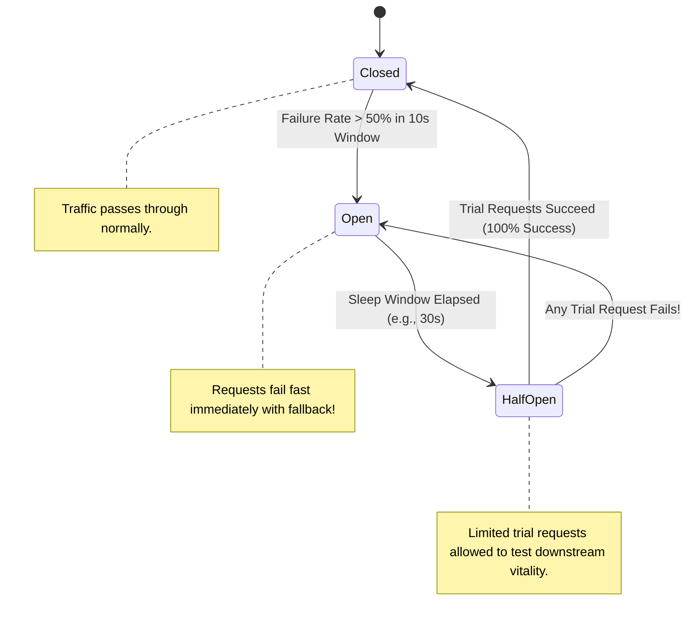

# Circuit Breaker Pattern

## 1. Purpose & States
The Circuit Breaker pattern (Michael Nygard) prevents an application from repeatedly attempting an operation that is almost certain to fail, saving CPU threads and preventing cascading failure across the enterprise.

---

## 2. Configuration Parameters (Resilience4j / Envoy Standard)
* **Failure Rate Threshold**: $50\%$ (if $50\%$ of calls fail over the evaluation window, trip to OPEN).
* **Slow Call Rate Threshold**: Trip to OPEN if $>50\%$ of calls exceed $2000\text{ ms}$.
* **Sliding Window Size**: 100 requests (or 10 seconds).
* **Wait Duration in Open State**: $30\text{ seconds}$ before transitioning to HALF-OPEN.
* **Permitted Number of Calls in Half-Open**: 10 trial requests.
