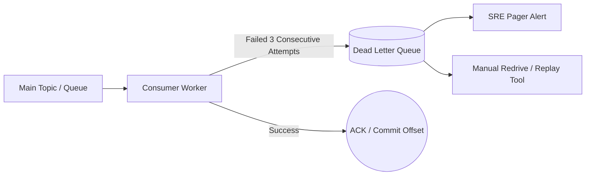

# Dead Letter Queue (DLQ) Architecture

## 1. Purpose of Dead Letter Queues
In event-driven message architectures, a consumer may encounter a message it cannot process (due to malformed schema, corrupted JSON, or persistent downstream database constraint violation). Without a DLQ, the consumer crashes or retries indefinitely, blocking the entire queue/partition.

---

## 2. SRE Operational Best Practices for DLQs
* **DLQ Depth Alerting**: Any non-zero message count in a DLQ represents an unhandled application defect or bad data contract. Set alert threshold: `DLQ_Depth > 0`.
* **Automated Redrive Pipelines**: Provide operational CLI tools to replay dead-lettered messages back to the primary topic once application bug fixes are deployed.
* **Message Metadata Preservation**: When moving messages to a DLQ, append diagnostic headers: `x-death-reason`, `x-original-topic`, `x-failed-timestamp`, and the full exception stack trace.
