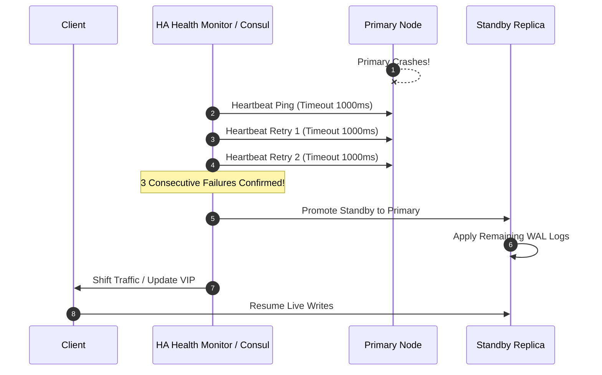

# Automated Failover Architecture

## 1. Mechanics of High-Availability Failover
Failover is the automated transition of operational traffic from an unhealthy primary component to a redundant standby or healthy replica.

---

## 2. The Flapping & False-Positive Dilemma
* **Triggering Too Fast**: Initiating failover after a single dropped $500\text{ ms}$ ping induces unnecessary failover thrashing during transient network blips.
* **Triggering Too Slow**: Sizing failure detection to 5 minutes violates enterprise RTO targets.
* **Standard SRE Rule**: Enforce **3 consecutive failed heartbeats** over a 5 to 15-second window before executing irrevocable primary promotion.
