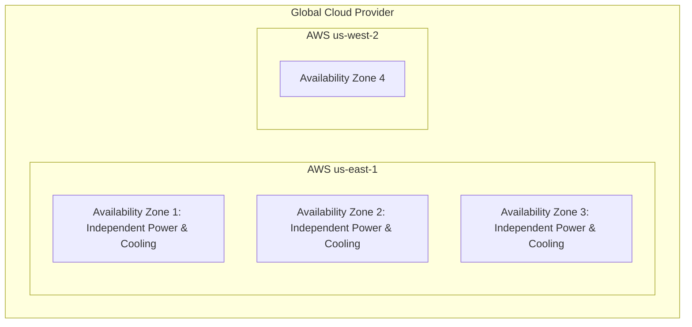

# Failure Domains & Blast Radius Containment

## 1. Defining Failure Domains
A **Failure Domain** is a physical or logical boundary within an architecture that shares common infrastructure, dependencies, or control planes such that a catastrophic failure within the boundary is contained and cannot propagate outward.

---

## 2. The Hierarchy of Failure Domains
1. **Process / Thread Domain**: A thread panic crashes a container; Kubernetes restarts the pod.
2. **Host / VM Domain**: A hypervisor kernel panic crashes the host; node-level autoscaler reschedules pods to other physical servers.
3. **Rack / Top-of-Rack (ToR) Switch Domain**: Power supply failure on a datacenter rack; cluster spreads replicas across separate racks via anti-affinity rules.
4. **Availability Zone (AZ) Domain**: Entire datacenter flooding or optical fiber cut; multi-AZ cluster routes traffic to adjacent AZs in $<2\text{ seconds}$.
5. **Cloud Region Domain**: Total cloud control plane outage or hurricane; active-active or warm-standby multi-region routing shifts global DNS.

---

## 3. Cell-Based Architecture (Blast Radius Minimization)
Rather than deploying one massive shared cluster, partition the platform into independent, self-contained **Cells** (each serving a subset of users, e.g., $100,000$ accounts per cell).
* If Cell 4 suffers a data-corrupting bug, **only 5% of users are impacted**; the remaining 95% of cells continue operating normally.
