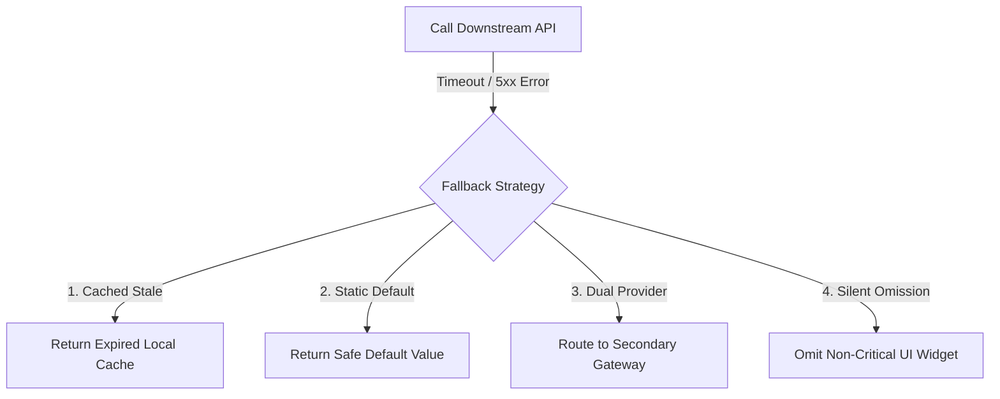

# Fallback Strategies & Design Patterns

## 1. Fallback Taxonomy
When an external call fails or times out, a fallback returns an alternative response to ensure caller continuity:

---

## 2. Multi-Provider Fallback (Dual Payment Gateway)
For mission-critical third-party integrations (e.g., credit card processing), implement multi-provider routing:
1. Primary Provider: Stripe ($95\%$ traffic).
2. If Stripe returns HTTP 5xx or times out $>2000\text{ ms}$:
3. Circuit breaker immediately diverts the transaction to Secondary Provider: Adyen.
4. *Result*: Enterprise payment uptime climbs from $99.9\%$ to **$99.999\%$**.
