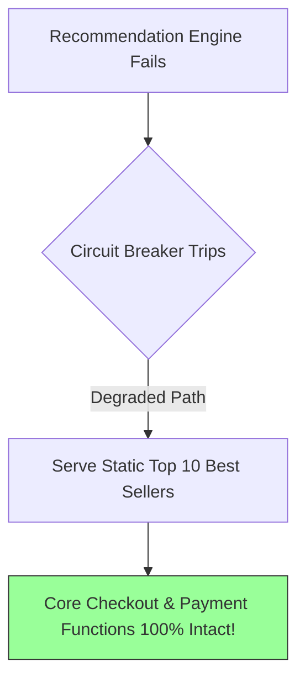

# Graceful Degradation Architecture

## 1. Principles of Degradable Systems
Graceful degradation ensures that when a subsystem or downstream dependency suffers an outage, the platform does not crash completely. Instead, it selectively disables non-essential, decorative, or computationally expensive features while preserving core revenue-generating business transactions.

---

## 2. Tiered Feature Degradation Matrix
| System Component | Full Operational State | Degraded Operational State |
| :--- | :--- | :--- |
| **Search Engine** | Real-time typo-tolerant personalized search | Exact keyword substring search or static catalog index. |
| **Recommendations** | Dynamic ML personalized suggestions | Static, pre-cached list of top items. |
| **Comments / Reviews** | Interactive posting and voting | Read-only mode or temporarily hidden from UI. |
| **Transactional Core** | Instant synchronous confirmation | Asynchronous order queuing (HTTP 202 Accepted). |
