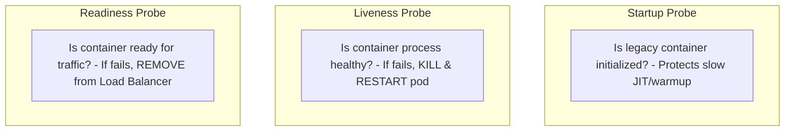

# Health Check Architecture

## 1. The Triad of Kubernetes Health Probes
Modern container orchestrators enforce three distinct health probe dimensions:

---

## 2. The "Deep Health Check" Anti-Pattern
A disastrous architectural mistake is executing **deep database queries** inside a liveness probe (`/healthz/liveness` executing `SELECT * FROM users`):
* If the primary database experiences elevated latency or transient lock contention, every liveness probe across 500 pods times out simultaneously.
* Kubernetes interprets this as a cluster-wide failure and **kills all 500 pods at once**.
* As 500 new pods restart simultaneously, their cold starts crash the database, creating a total unrecoverable brownout.

### Production Standard
* `/healthz/live`: Shallow in-memory check (returns HTTP 200 immediately if process event loop is responsive).
* `/healthz/ready`: Validates internal queues and local buffers; soft-fails by dropping off the load balancer without killing the process.
