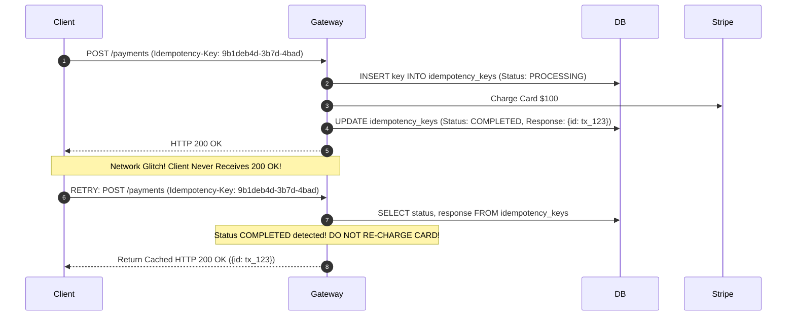

# Idempotency Architecture & Distributed Deduplication

## 1. Mathematical Definition
An operation is **idempotent** if executing it multiple times produces the exact same side-effects and outcome as executing it once:
$$f(f(x)) = f(x)$$

In distributed systems where network drops force clients to retry requests, idempotency is **mandatory** to prevent duplicate credit card charges, duplicate bank transfers, or duplicate inventory deductions.

---

## 2. Implementation with Redis / Distributed Locks
* Use atomic `SET key value NX EX 86400` (set if not exists with 24-hour TTL).
* If key exists and status is `PROCESSING`: return `HTTP 409 Conflict` (request currently in flight).
* If key exists and status is `COMPLETED`: return stored response payload immediately.
