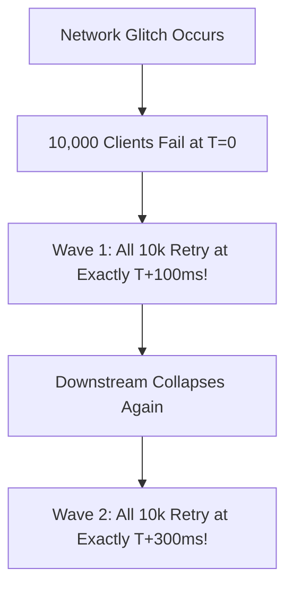

# Jitter Architecture & Lockstep Resonance

## 1. The Lockstep Resonance Problem
When thousands of clients experience a network glitch at the exact same moment (e.g., a router restart), pure exponential backoff causes all clients to wait the exact same duration ($100\text{ ms}$, then $200\text{ ms}$, then $400\text{ ms}$). They retry simultaneously in **lockstep**, creating periodic waves of synchronized traffic spikes that re-collapse the recovering service.

---

## 2. Jitter Algorithms & AWS Formulas
Jitter introduces randomness to break synchronization resonance:

### 1. Full Jitter (AWS Best Practice)
Sleep a uniform random duration between $0$ and the exponential backoff ceiling:
$$T_{\text{sleep}} = \text{Random}\left(0, \min(T_{\text{max}}, T_{\text{base}} \times 2^a)\right)$$

### 2. Equal Jitter
Keep half the delay deterministic, and randomize the other half:
$$T = \min(T_{\text{max}}, T_{\text{base}} \times 2^a)$$
$$T_{\text{sleep}} = \frac{T}{2} + \text{Random}\left(0, \frac{T}{2}\right)$$

### 3. Decorrelated Jitter
Randomize delay based on the previous sleep duration:
$$T_{\text{sleep}} = \min\left(T_{\text{max}}, \text{Random}(T_{\text{base}}, T_{\text{prev}} \times 3)\right)$$
