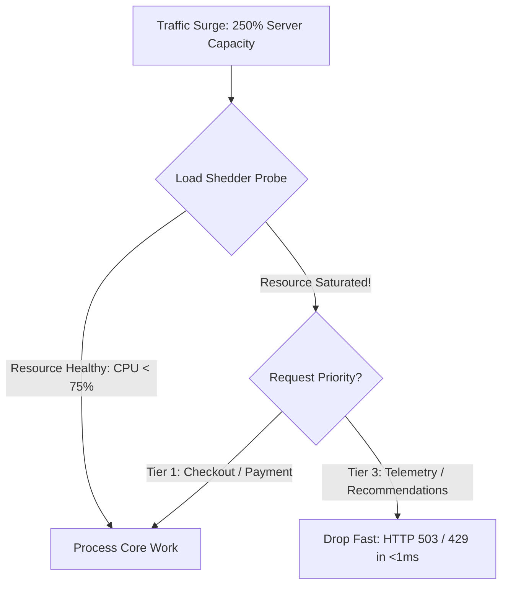

# Load Shedding Architecture

## 1. Load Shedding vs. Rate Limiting
* **Rate Limiting**: Rejects requests based on client identity or quota limits (e.g., Client X exceeded 100 RPS).
* **Load Shedding**: Rejects requests based on **internal server health and saturation**, regardless of client identity. When CPU or queue wait times breach safe thresholds, the server sheds excess load immediately to protect in-flight transactions.

---

## 2. Sizing Load Shedding: Queue Time Tracking (CoDel)
Shedding load based on raw CPU utilization is often too slow. SRE best practice measures **Queue Wait Time ($T_q$)**:
* If incoming requests spend $>50\text{ ms}$ waiting in the HTTP thread queue before being touched by a worker thread, the server is oversaturated.
* Drop all newly arriving low-priority requests immediately with `HTTP 503` and a `Retry-After: 5` header, allowing the worker pool to drain existing in-flight work.
