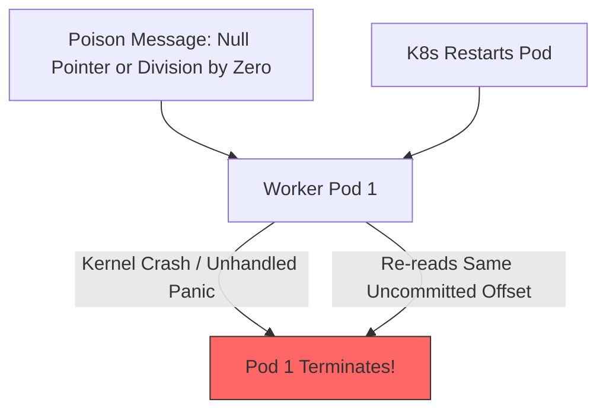

# Poison Message Handling & Prevention

## 1. Defining the Poison Message
A **Poison Message** is a payload that causes the consumer software to crash or enter an unrecoverable error state every single time processing is attempted. In Apache Kafka, because partitions must be processed strictly in offset order, a single poison message freezes the entire partition consumer group.

---

## 2. Defensive Architectural Patterns
1. **Schema Registries & Ingress Validation**: Validate all incoming payloads against strict Apache Avro, Protobuf, or JSON Schema contracts at the API gateway *before* publishing to the broker.
2. **Circuit Breaker on Kafka Consumers**: Wrap deserialization in comprehensive `try/catch` blocks. If payload fails schema validation, log error, route immediately to DLQ, and commit the offset to allow subsequent messages to proceed.
