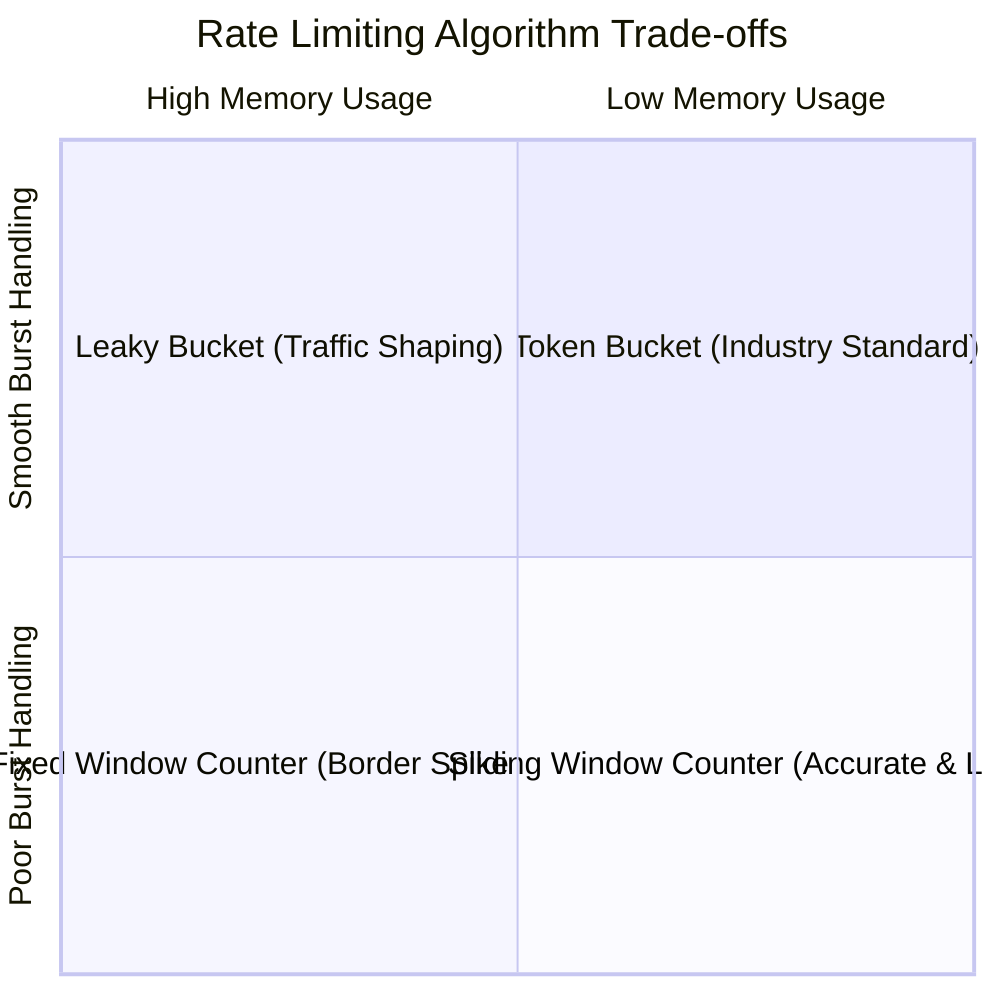

# Rate Limiting Architecture

## 1. Rate Limiting Algorithms Comparison

---

## 2. Deep Dive: Core Algorithms

### 1. Token Bucket
* Tokens added to bucket at a steady fill rate $R$ (tokens/sec) up to maximum capacity $B$.
* Each incoming request consumes 1 token. If tokens available, request proceeds; otherwise rejected with `HTTP 429`.
* **Advantage**: Accommodates natural short-duration traffic bursts up to bucket size $B$.

### 2. Leaky Bucket
* Requests enter a FIFO queue (bucket) of capacity $B$ and leak out at a strictly constant rate $R$.
* **Advantage**: Perfectly smooths out spiky traffic for sensitive downstream legacy systems.

### 3. Sliding Window Counter
* Interpolates request counts between the previous time window and the current window:
$$\text{Estimated Count} = \text{Count}_{\text{current}} + \text{Count}_{\text{prev}} \times \left(1 - \frac{\text{Time Elapsed in Current Window}}{\text{Window Duration}}\right)$$
* Eliminates fixed-window boundary burst exploits with minimal memory footprint ($O(1)$ memory).
