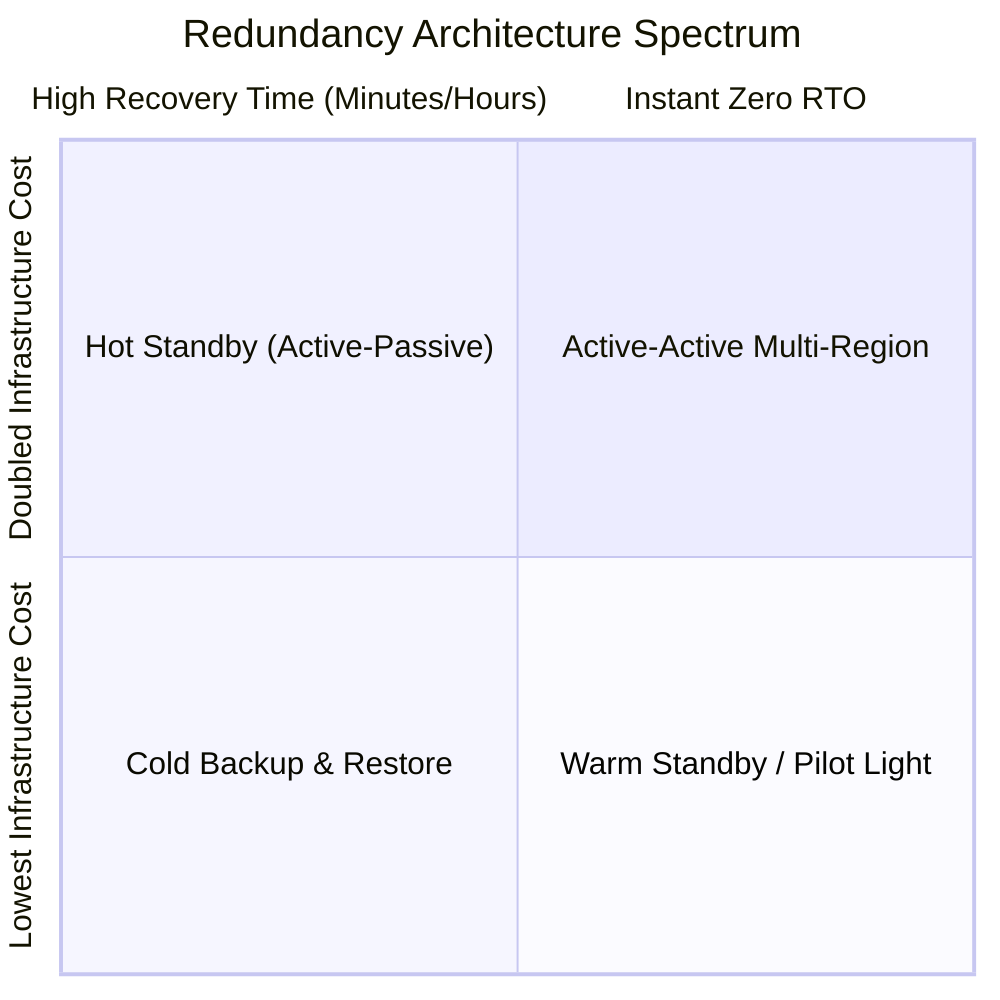

# Redundancy Models: Active-Active, Active-Passive, and N+M

## 1. Redundancy Classification

---

## 2. Deep Dive: Redundancy Topologies

### 1. Active-Passive (Hot Standby)
* Primary node processes $100\%$ of read/write traffic.
* Standby replica continuously replicates state (WAL stream).
* An automated heartbeat / arbitrator triggers promotion on primary crash.
* *Trade-off*: Underutilized standby hardware ($50\%$ idle CapEx); brief failover latency ($10\text{--}60\text{ seconds}$).

### 2. Active-Active
* Two or more nodes/regions concurrently process live read and write traffic.
* *Advantage*: Zero failover downtime; continuous real-world verification of all nodes.
* *Challenge*: Cross-node data conflicts and distributed write synchronization.

### 3. N+M Redundancy
* $N$ nodes handle operational load; $M$ spare nodes stand by to replace any failed instance.
* For $N=10$ worker nodes and $M=2$ spares: cluster survives 2 arbitrary node failures with only a $20\%$ hardware cost overhead.
