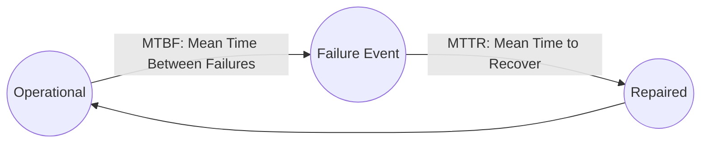

# Reliability Modeling: MTBF, MTTR, and MTTF

## 1. Core Metrics & Definitions
Reliability models failure rates over continuous operational time:

* **MTTF (Mean Time to Failure)**: For non-repairable components (e.g., physical hard drive life expectancy before permanent failure).
* **MTBF (Mean Time Between Failures)**: For repairable distributed services.
* **MTTR (Mean Time to Recover)**: Time required to detect, diagnose, failover, or restart.

---

## 2. Improving Availability: Why MTTR Trumps MTBF
Mathematically:
$$A = \frac{\text{MTBF}}{\text{MTBF} + \text{MTTR}}$$
In distributed cloud software, preventing servers from ever failing (maximizing MTBF) is impossible. **Minimizing MTTR via automation is the only viable path to Four and Five Nines**:
* If $\text{MTBF} = 30\text{ days} = 43,200\text{ mins}$, and manual human recovery takes $\text{MTTR} = 60\text{ mins}$:
  $$A = \frac{43,200}{43,200 + 60} = \mathbf{99.86\%}$$
* If automated health checks and Kubernetes pod failovers drop $\text{MTTR} = 15\text{ seconds} = 0.25\text{ mins}$:
  $$A = \frac{43,200}{43,200 + 0.25} = \mathbf{99.9994\%} \quad (\text{Five Nines achieved!})$$
