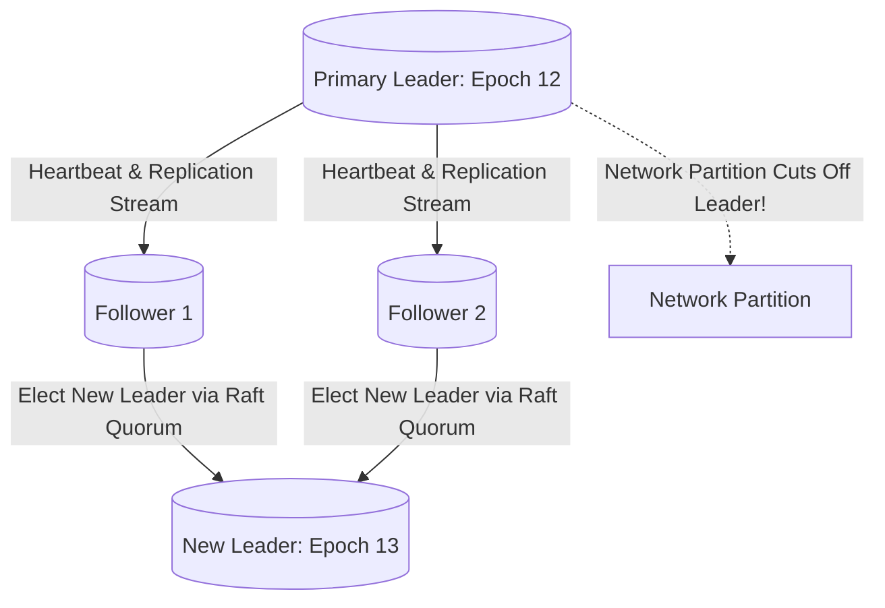

# Replication for Fault Tolerance

## 1. Reliability Goals of Replication
In distributed systems, replication serves as the primary defense against permanent hardware loss and transient network partitions. It ensures data survives the catastrophic loss of disks, servers, and entire cloud data centers.

---

## 2. Split-Brain Prevention: Fencing Tokens & Quorum Consensus
When a network partition isolates the leader from its followers, a catastrophic failure mode arises: the old leader continues accepting writes while followers elect a new leader (**Split-Brain**), resulting in irrecoverable data divergence.

### Fencing Token Protocol
1. Every leader election assigns a monotonically increasing **Epoch Number / Fencing Token** (e.g., Epoch 13).
2. All writes to the storage subsystem or external API must present the current fencing token.
3. The storage layer rejects any write carrying an outdated token (e.g., from the zombie former leader with Epoch 12).
