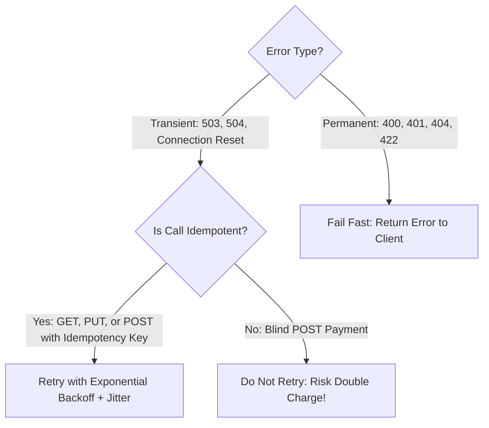

# Retry Architecture & Retry Storms

## 1. When to Retry
Retries heal transient network glitches (TCP reset, packet drops, brief DNS resolution timeouts). However, retrying non-transient errors (HTTP 400 Bad Request, 401 Unauthorized, 404 Not Found) wastes resources.

---

## 2. The "Retry Storm" Disaster
When a downstream database slows down under load:
1. Upstream services time out.
2. Every upstream client immediately sends 3 retries.
3. Traffic multiplying by **$4\times$** lands on the already struggling database.
4. The database suffers complete collapse.

### Retry Storm Defenses
* **Retry Budgets**: Limit retries to a maximum of **$10\%$ of total outgoing requests**. If retries exceed $10\%$, fail immediately without retrying.
* **Circuit Breakers**: Trip the circuit when downstream error rate exceeds $50\%$, stopping all retries instantly.
