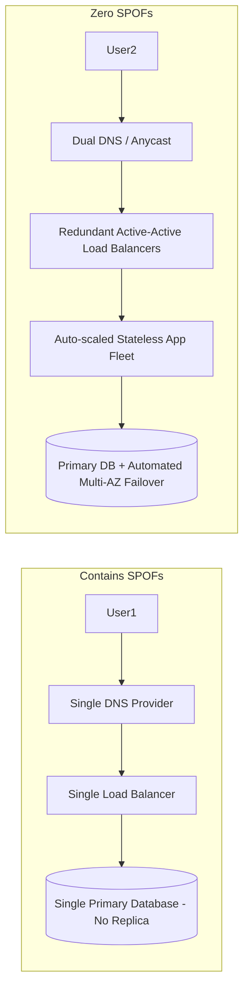

# Eliminating Single Points of Failure (SPOF)

## 1. Identifying Single Points of Failure
A Single Point of Failure (SPOF) is any component whose failure halts the operation of the entire system. Eliminating SPOFs is the primary rule of high-availability design.

---

## 2. Common Hidden SPOFs in Enterprise Cloud Systems
* **Single NAT Gateway**: Placing all private subnets behind a single AWS NAT gateway; an AZ failure kills internet egress for the entire VPC.
* **Hardcoded Third-Party Webhooks / Identity Providers**: A failure in Okta or Stripe halts internal login or checkout threads.
* **Shared Central Distributed Cache**: If Redis crashes and the application lacks a database fallback or circuit breaker, the entire site collapses.
* **Single DNS Registrar / Provider**: If Route53 or Cloudflare suffers an administrative lockout or control-plane outage, all traffic vanishes.
