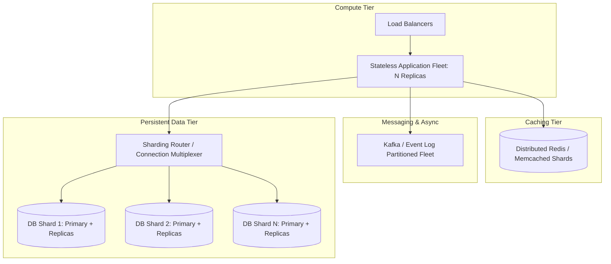
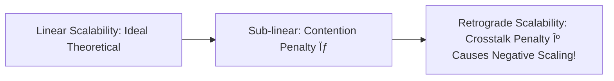

# Scalability Engineering

## 1. Overview & Architectural Philosophy
Scalability is the structural property of a system to handle increased load without degrading performance, reliability, or exponentially inflating operational expenditure. In Fortune 500 enterprise architectures, scalability is not merely "adding more servers"—it is the deliberate decoupling of state, asynchronous event choreography, partition topology design, and hotspot mitigation.

---

## 2. Universal Scalability Laws

### 1. Amdahl's Law
Amdahl's Law defines the theoretical speedup limit of a system when parallelized across $N$ processors, constrained by the serial fraction ($s$):
$$\text{Speedup}(N) = \frac{1}{s + \frac{1 - s}{N}}$$
* If $10\%$ of a transaction is strictly serial ($s = 0.10$, e.g., acquiring a global mutex), the maximum theoretical speedup is capped at $10\times$, regardless of provisioning $1,000$ cores.

### 2. Gunther's Universal Scalability Law (USL)
Gunther extends Amdahl's Law by incorporating **coherency delay** ($\kappa$), which represents the cost of crosstalk, serialization, and distributed consensus:
$$C(N) = \frac{N}{1 + \sigma(N - 1) + \kappa N(N - 1)}$$
Where:
* $N$ = Concurrency or node count
* $\sigma$ = Serialization contention parameter
* $\kappa$ = Coherency crosstalk parameter ($N(N-1)$ pairwise communication penalty)

*Architectural Reality*: If a distributed system requires every node to coordinate with every other node (high $\kappa$), adding more nodes past a threshold **decreases total throughput**.

---

## 3. Scalability Dimensions & Topics
This section provides deep, authoritative guides across all scalability domains:
* [Horizontal Scaling](horizontal-scaling.md)
* [Vertical Scaling](vertical-scaling.md)
* [Stateless Services](stateless-services.md)
* [Stateful Services](stateful-services.md)
* [Database Scaling](database-scaling.md)
* [Read Scaling](read-scaling.md)
* [Write Scaling](write-scaling.md)
* [Cache Scaling](cache-scaling.md)
* [Queue-Based Scaling](queue-based-scaling.md)
* [Partition-Based Scaling](partition-based-scaling.md)
* [Sharding](sharding.md)
* [Replication](replication.md)
* [CDN Scaling](cdn-scaling.md)
* [Asynchronous Scaling](async-scaling.md)
* [Elasticity](elasticity.md)
* [Hotspot Management](hotspot-management.md)
* [Large Tenant Scaling](large-tenant-scaling.md)
