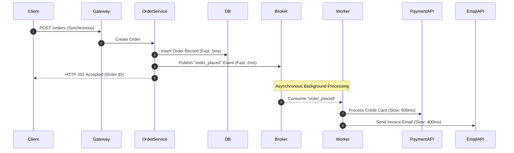

# Asynchronous Scaling Architecture

## 1. Decoupling Synchronous Execution Paths
In synchronous architectures, a client HTTP thread blocks while the server executes end-to-end processing (validating input, querying database, generating PDF invoices, sending emails, calling third-party payment gateways). The system scale is bounded by thread pool exhaustion.

---

## 2. Asynchronous Patterns for Scalability

### 1. The HTTP 202 Accepted & Polling / Webhook Pattern
For long-running transactions (>500ms):
1. Client submits job via `POST /reports`.
2. Server immediately returns `HTTP 202 Accepted` with a `job_id` and `Location: /reports/jobs/{id}/status`.
3. Client polls status or registers a Webhook callback URL.

### 2. Event Choreography vs. Orchestration
* **Event Choreography**: Services react to events autonomously. `OrderService` emits `OrderCreated`; `InventoryService` listens and reserves stock; `PaymentService` listens and charges card. High decoupling, but complex failure tracking.
* **Orchestration (Saga Coordinator)**: A centralized state machine (e.g., Temporal, AWS Step Functions) explicitly commands each participant step and manages compensating rollback transactions.
