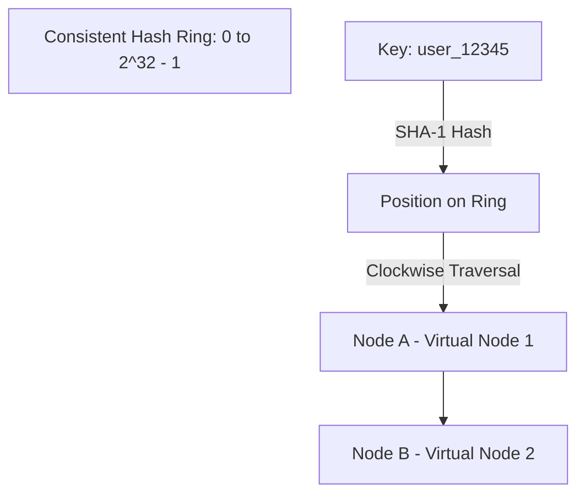

# Cache Scaling Architecture

## 1. Scaling In-Memory Systems Beyond a Single Node
Single-instance caches eventually saturate physical RAM, single-threaded CPU execution (Redis), or network interface card (NIC) throughput. Scaling cache requires transitioning from a single cache node to a distributed, partitioned cluster.

---

## 2. Consistent Hashing & Virtual Nodes

When scaling a cache cluster dynamically, traditional modular hashing ($\text{Node} = \text{Hash}(K) \pmod N$) causes catastrophic cache eviction: adding 1 node invalidates $\approx 100\%$ of keys, triggering a massive database collapse.

### The Consistent Hashing Guarantee
When a node joins or leaves a cluster using consistent hashing:
$$\text{Fraction of Keys Re-mapped} = \frac{1}{N}$$
Where $N$ is the total number of nodes in the cluster.

*Virtual Nodes (Vnodes)*: Each physical node is assigned $100\text{--}250$ points on the hash ring. This eliminates "hash skew" and guarantees uniform distribution of keys and memory utilization across heterogeneous physical hosts.

---

## 3. Cache Invalidation Patterns

| Pattern | Write Flow | Read Flow | Trade-offs |
| :--- | :--- | :--- | :--- |
| **Cache-Aside (Lazy Loading)** | Application writes to DB, then evicts/deletes key from cache. | App checks cache; on miss, reads from DB and populates cache. | Resilient to cache crashes; slight risk of stale reads during race conditions. |
| **Write-Through** | App writes to cache; cache synchronously writes to DB before returning. | App reads from cache. | Guarantees cache freshness; higher write latency. |
| **Write-Behind (Write-Back)** | App writes to cache; cache acknowledges immediately and writes to DB asynchronously. | App reads from cache. | Blazing write performance; risk of permanent data loss if cache crashes before DB flush. |
